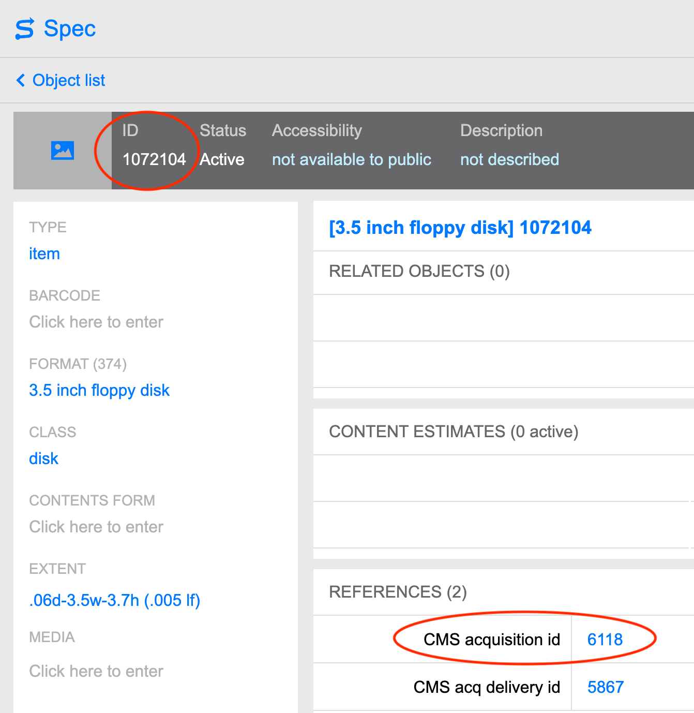
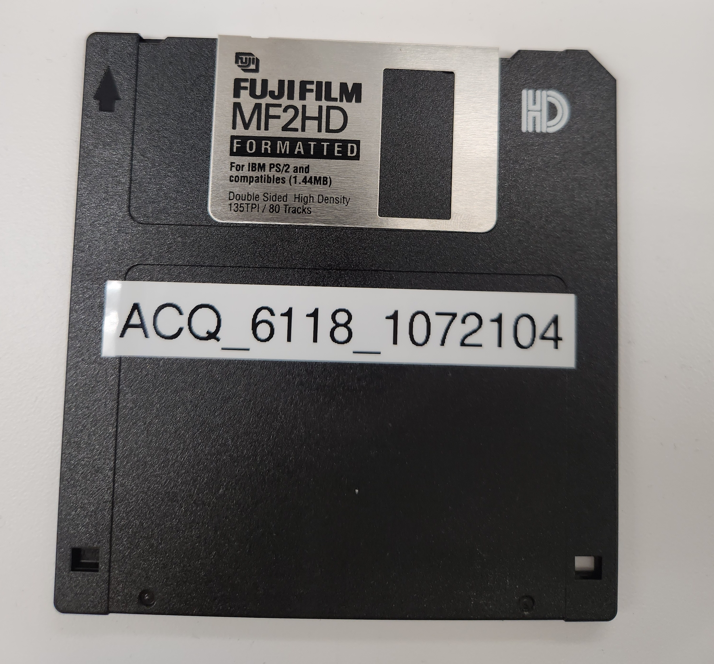
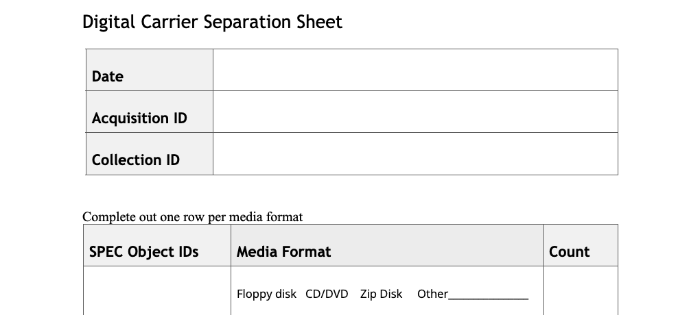

# Digital Carrier Separation (Accessioning)
{: .no_toc }

## Table of contents
{: .no_toc .text-delta }

1. TOC
{:toc}

# Introduction

Digital carrier separation procedures are detailed in this document. The workflows may vary based on media types encountered but the general steps are as follows:  

* Remove digital carriers from folders and boxes.  
* Create a SPEC object record for each carrier.  
* Label digital carriers.  
* Fill out Digital Carrier Separation sheets.  
* Place Digital Carrier Separation sheets where carriers where found.  
* House digital carriers.  
* Inform Digital Archives of digital carriers.  


When digital carriers are encountered during accessioning of an acquisition, Collection Management performs the digital media separation.
If there are 400 or more digital carriers in an acquisition, Digital Preservation staff may need to assist.

When digital media is encountered during processing of archival collections, the processing archivists perform the digital media separation.

|When commercial software is present, staff should send it as is to Digital Preservation without inventorying or labeling.|

## Remove digital carriers from folders.  
* House digital carriers in boxes separate from other material.  

## Create a SPEC object record for each carrier.  
* Create an object record in SPEC for each carrier according to Collection Management practices.  
* Note the acquisition number and the SPEC object ID number. Both are needed to create the ID label.
* ACQ_acqID_specObjectID ```ACQ_12345_54321``` is the carrier ID used by Digital Preservation.  

In the image of a SPEC object record below the SPEC Object ID is circled in top left and acq ID is circled in bottom right.  



|Label transcript is an optional field. If you want to transcript a label you can enter text as it appears on the label. You can enter ```[illegible]``` for words you can't decipher.|  

## Label carriers.

* For floppy and zip disks, print the label with ACQ_acqID_specObjectID and affixed it to the media.

  

* For Optical media (CDs, DVDs), print the label with ACQ_acqID_specObjectID.  
* House CDs or DVDs in a sleeve or case if they are not housed.  
* Rehouse CDs or DVDs that are cased together, unless the case is designed for multiple discs.  
* Affix the label to the sleeve or case.  

|**Make sure no label adhesive sticks to moving parts of the media.**  
Many media types have shutters, gates, or spools that need to move freely to work. Covering a shutter or other moving part with a label can damage the disk and the drive used to read media.|  

* Check in with Digital Preservation staff to discuss labeling other media types.  

|Digital Preservation staff can label commercial software with a simple collection name.
```Crouch``` for Stanley Crouch papers.|

<!-- ### Floppy disk
  

### Optical media
    -->

## Fill out a digital carrier separation form.  

| Processing archivists should skip this step. They should remove any separation sheets before arrangement is finished and the colleciton is shipped.|  

* Fill out a
[digital carrier separation form](https://docs.google.com/document/d/1ZWZ2xMUMPPMV1f0V6CesB-qz1IK5u765Wmr_0ESiZ6U/edit?usp=sharing){:target="_blank"} to document where in the collection a media object came from. 

* Enter the object's acquisition id number and collection id.  
* Enter the object's SPEC object id.    
* Circle the format on the form.  
* Enter the correct format after the word Other if the format is not listed.  
* See [Identifying Digital Media](../sitevisits/identifying-digital-media) for media format types.



## Shelve the media.

* Place completed boxes on shelf 02 in 205. The shelf is closest to 205A.  
* Email [digitalarchives@nypl.org](mailto:digitalarchives@nypl.org) and confirm boxes are shelved.  

