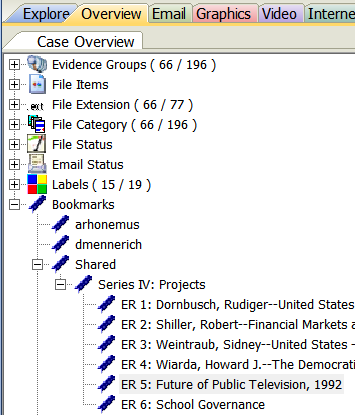

# Bookmarking
Bookmarks are a hierarchical organization system in FTK that you will use to create ER components. Bookmarks can be viewed in the bookmarks tab. Bookmarks are used to group together files into an intellectual component to be entered into Aspace. It is in a bookmark that the unit identifier, unit title, and date coverage will all be recorded.

## Naming Conventions

There are currently two ways to enter ER components in ASpace. You can manually enter ERs in ASpace or Digital Archives staff can create a JSON export of the bookmarks. You must use the following conventions for JSON to be created correctly.

* Create Bookmarks with Series or Heading titles. These bookmarks have no files.
* Create ER bookmarks with files under Series/Heading bookmarks.

## Creating Bookmarks

-   Create empty bookmarks to mimic the hierarchical structure of the finding aid.  
    * Right-click a top level bookmark in the Bookmarks tab and select 'Create empty bookmark'.  
    * Drag and drop bookmarks to place them in the hierarchy.  

-   Wait until
    you are finished processing to number your ER components.

## Finalizing Bookmarks
* Enter the unit id, unit title, and date range of the files in the Bookmark Name field.  
* Bookmark Name: ER[space]number: Title, dates.  
  ```ER 5: Future of Public Television, 1992```



## Bookmark contents
When you have finished bookmarking, bookmarks should usually contain one level of files and no folders within it. Each bookmark with files in it should be a numbered ER. Series and Collection level bookmarks should not contain files.

* Numbered ERs should contain 1 level of files only and no folders


## Exceptions
Here are exceptions to the guidelines above. 

### Disk Images
Although I have said that file systems should not be bookmarked, We may ask you to bookmark file systems if we need to create disk image packages for access. We should check-in and have a conversation about arrangement before you create bookmarks to represent DI packages.

* Do bookmark file systems if digital archives staff say to create DI packages

### Folders
It’s also possible that we will encounter cases where folder structure needs to be retained for access in specific software. This is also a case where we will need to have a conversation before you create bookmarks with folders. Digital Archives staff will need to know the folder structure you need. Creating the right folder structure requires manipulating options in FTK. The correct folder structure may not be possible to achieve with FTK in many cases. Ideally, when a specific folder structure is needed it will be created from a transfer outside of FTK. This is much easier. When you find you need to retain recursive folders this work should usually done at an archivist workstation.

* Retaining a folder structure to view files in specific software 
  * (AV projects, website backends)
* Discuss folder structure with Digital Archives staff 
* Make sure DA staff are aware folders will be retained before export
* Retaining folder structure across a collection
  * Arrange files at archivist workstation if you need recursive folders
  * More that 1 ER folder containing files per ER

### Folder Export options
The options available for folder export in FTk to export the entire path down to the media container (data folder of MediaID) or retaining a bookmarked folder. Even if a folder within the bookmarked folder isn’t bookmarked it will be exported along with the bookmarked folder.

* Original path
  * All folders including data or MediaID
* Bookmarked folder and all folders within

### Options for arrangements with folders
When you want to retain folders in your arrangement you have 3 options. This arrangement is easiest outside of FTK so even if the collection is loaded in FTK you may want to discuss this option with Digital Archives staff. 
You can arrange the contents of each folder as a separate ER. This is the easiest to do in FTK because it conforms to FTK’s defaults.
You can discuss exporting folders in FTK with Digital Archives staff. Remember you can only choose to retain an entire file path from the MediaID or you can choose to retain a folder and everything in it. You can’t exclude any content from folders with these options.

* Arrange folders outside of FTK
* Arrange the contents of each folder as an ER (ER 1, ER 2)
* Discuss exporting folders in FTK with Digital Archives staff

## Deaccessions

* Select the Bookmarked filter.  
* Select each media object in the evidence items window one by one.  
* Note media objects with no files present.  

OR

* Select the Bookmarked filter and sort the File List by path.  
* Note MediaIDs that don't appear in the File List.  

* Keep media objects that contain executables served as a disk image.