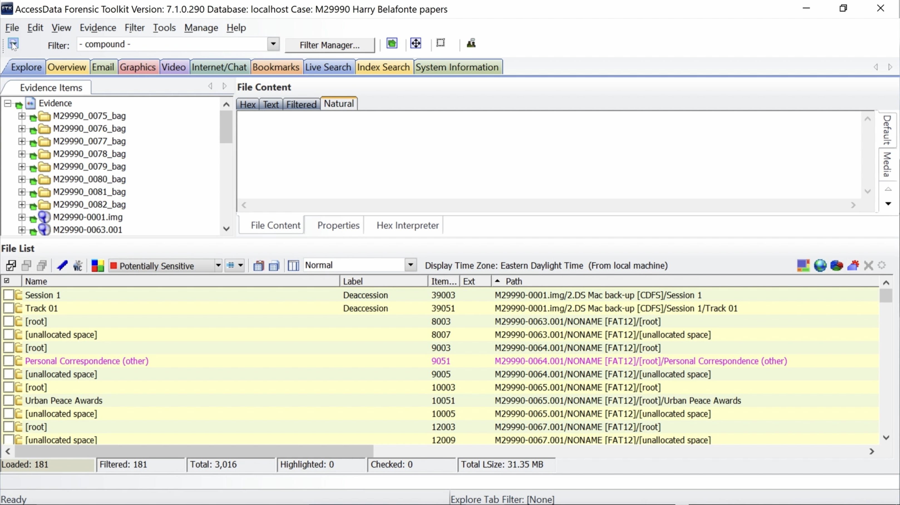
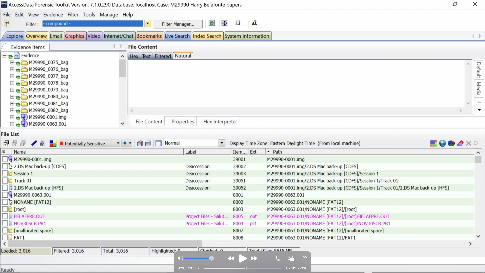
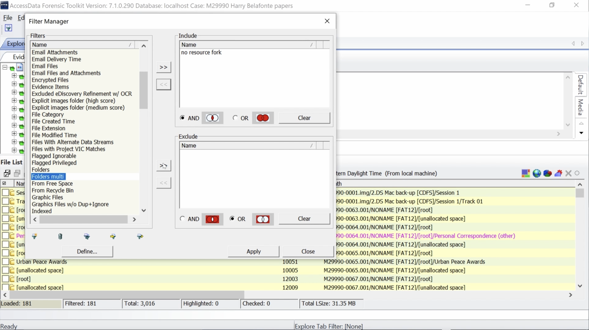

# Compound Filters
This video shows how to use compound filters in FTK. compound filters are an option when available saved filters don't work and you don't want to create definitions from scratch. It displays the difference between applying different operations to the Include and Exclude box. It demonstrates how the File List looks when filters are active and how to toggle filters on and off.

  <iframe
      src="https://www.youtube.com/embed/VSDt2P0fJOo"
      width="700"
      height="480"
      frameborder="0"
      allowfullscreen="true">
  </iframe>

## Include

Click Filter Manager

Select a filter from the Filters list. Click on the right arrow button next to Include box.

The selected filter is applied to Include. Select Define to view filter Rules.

Note Operators Is.

Check Filter Definition for filter no resource fork. Note Operator Does Not Start with. Click Close.

Click right arrow button next to Include box to apply no resource fork filter to Include.

Note that folders are displayed when the compound filter is on.

Click funnel icon on upper left to toggle filter off.

## Exclude

Click Filter Manager

Select Folders filter. Click left arrow button next to Include box.

Select Folders filter. Click right arrow button next to Exclude box.

Folders filter is now applied to Exclude.

Note Folders are now hidden with filter applied.

Click funnel icon in upper left corner to toggle filter off. Folders are now displayed.