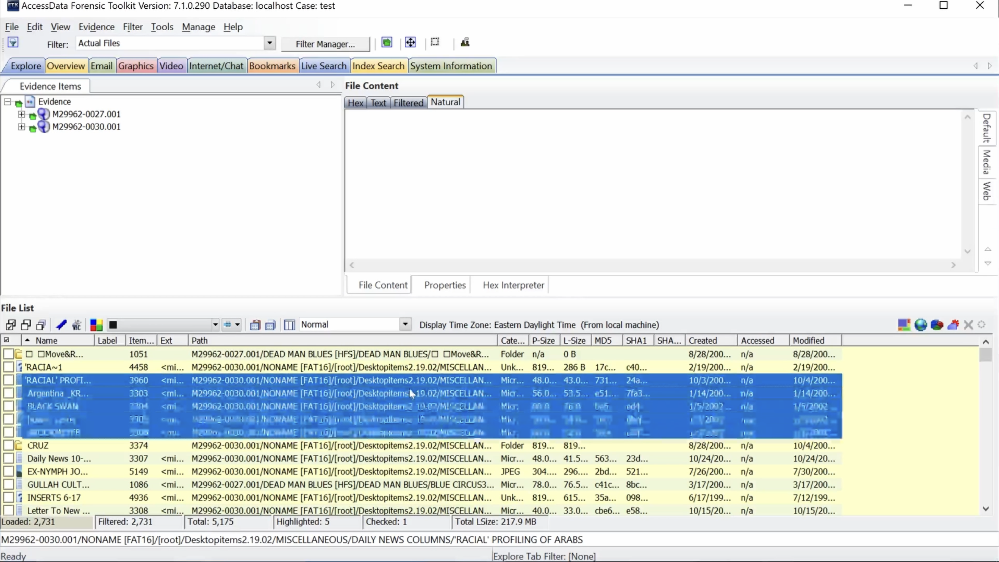
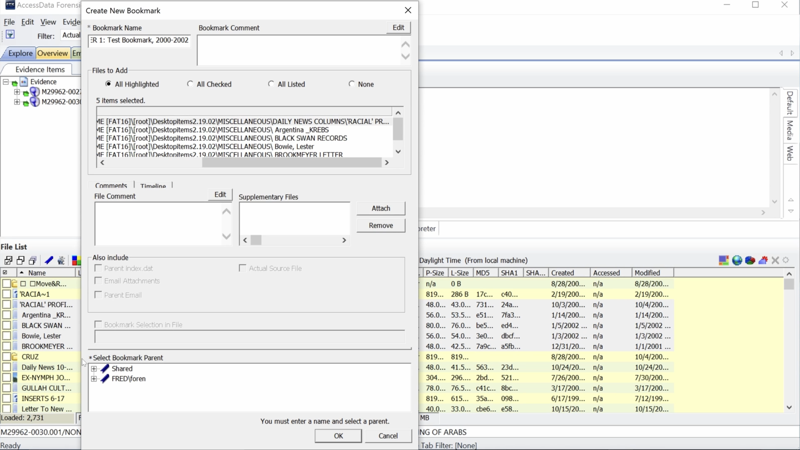
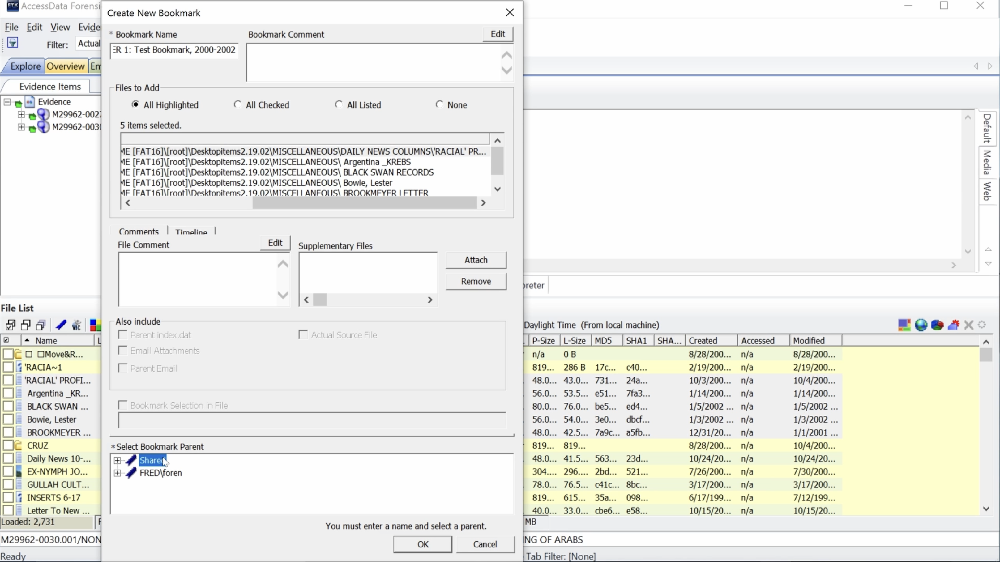

# Creating a bookmark
This video displays how to create a bookmark from the Explore tab in FTK. It uses the naming convention that should be used for ERs.

  <iframe
      src="https://www.youtube.com/embed/X-rWMNFufaE"
      width="700"
      height="480"
      frameborder="0"
      allowfullscreen="true">
  </iframe>

Highlight a range of files by selecting the first file, holding down shift, and selecting the last file.

Right Click. Select Create Bookmark.

Type Bookmark name in top left box. ER[space]number: Name, dates

Select Shared under Select Parent Bookmark. The bookmark will appear under Shared.

Select Bookmarks tab. The bookmark appears under Shared, the selected parent bookmark.
