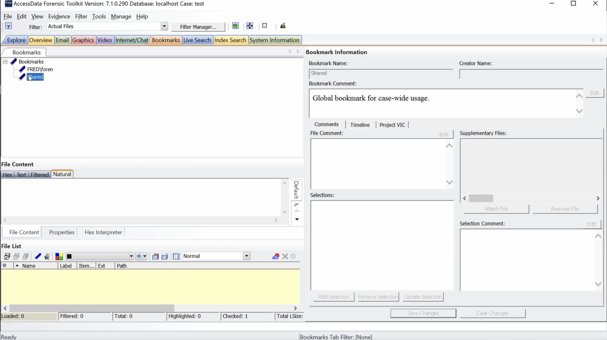
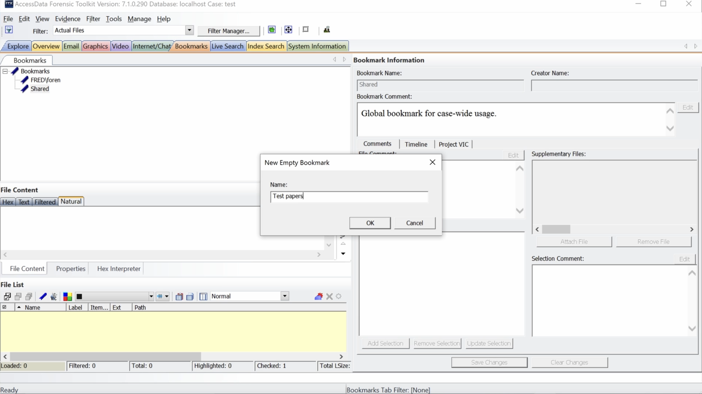
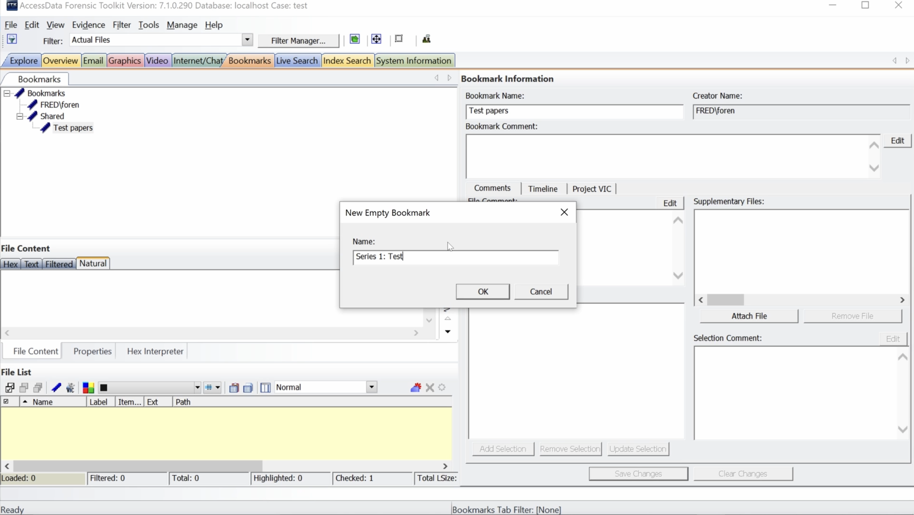
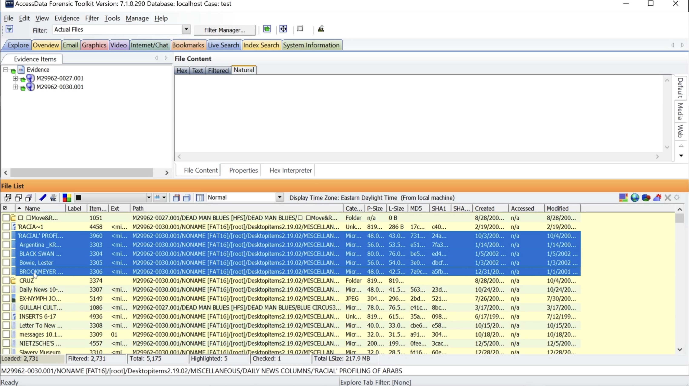
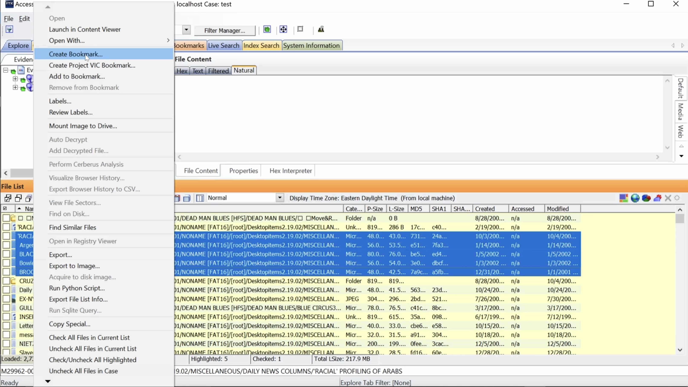
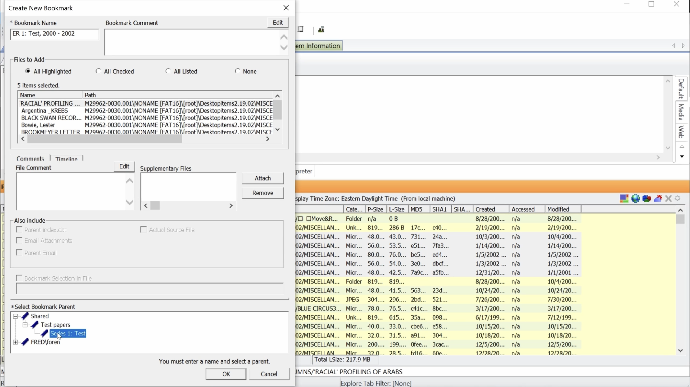
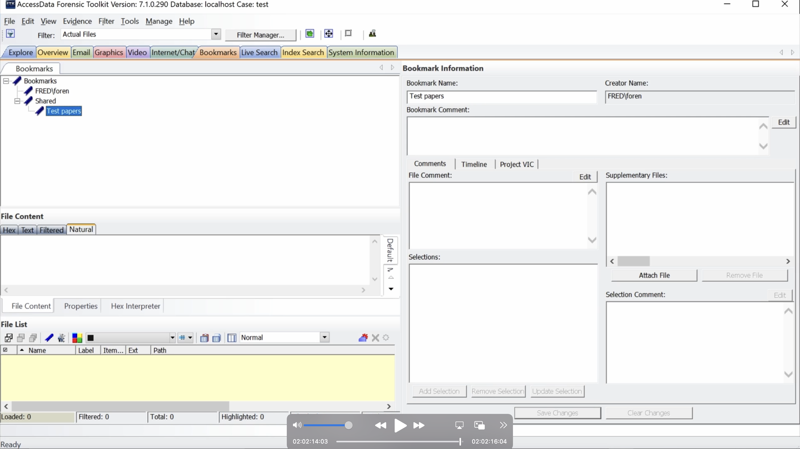

# Creating bookmark hierarchy
This video shows how to create a bookmark hierarchy using empty bookmarks to mirror your arrangement. You will need to create series or heading level bookmarks to use the ASpace import feature. The video also show you how to create a bookmark with files. It also demonstrates what happens when you delete a higher level bookmark. Everything below is deleted too!

  <iframe
      src="https://www.youtube.com/embed/UcservTIbP4"
      width="700"
      height="480"
      frameborder="0"
      allowfullscreen="true">
  </iframe>

## Create empty bookmark

From Bookmarks tab, select parent bookmark, Shared.

Right click. Select Create Empty Bookmark.

Type bookmark name in Name box. Click OK.

Select bookmark you just created, Test papers. Right click. Select Create Empty Bookmark.

Type bookmark name in Name box. Click OK.

## Create bookmark with files

Click Explore tab. Now create a bookmark with files.

Highlight a range of files by selecting the first file, holding down shift, and selecting the last file.

Right Click. Select Create Bookmark.

Type bookmark name in Bookmark Name box. Select parent bookmark, Series 1: Test. Click OK.

## Delete bookmark

To delete a bookmark, select bookmark from Bookmarks tab. Right Click. Select Delete Bookmark.

The bookmark and all bookmarks below are deleted.