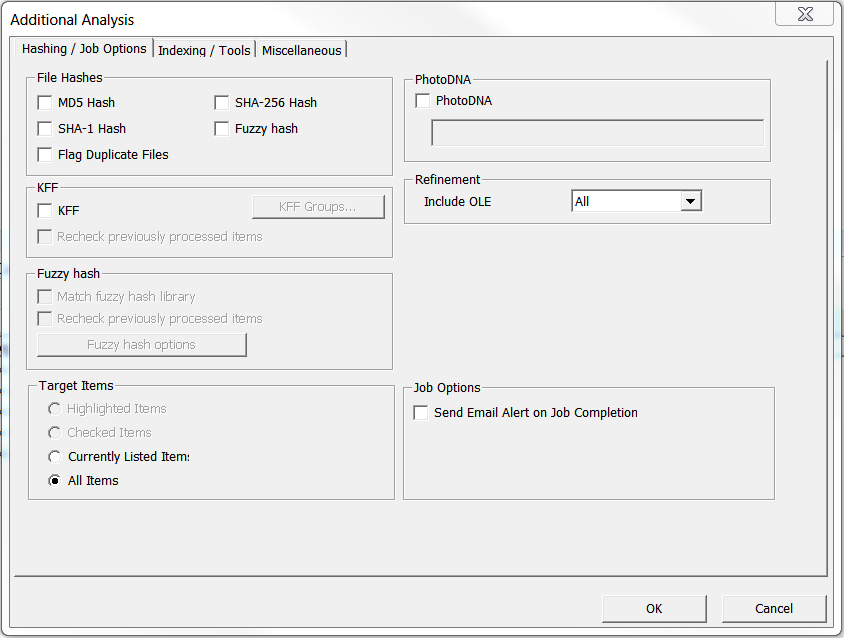
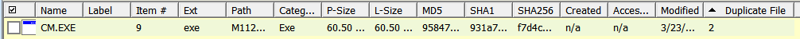

# De-duplicating Collections
Using a filter to hide duplicate files is an optional method of managing the amount of files surveyed.

## Running a De-duplication Job

* Select Additional Analysis from
the Evidence menu. 

* Select Flag Duplicate Files from the File Hashes group and click OK.

* This will start a comparison of the checksums of all files in the
collection.

* When complete close the Data Processing window.

## Adding a Duplicate File Column Set to a FTK Case

* Click the column
settings button from the File List window.  
* Click the import button and navigate to Storage(F:)\\FTKsettings\\ColumnDefs\\Duplicates.xml  
* Click OK and close the column settings window.

* Select Duplicates from the column dropdown.

## Reading the Duplicate File Field
* Note the Duplicate File field in the File List.  
* Note the number in the Duplicate File field.  

* If the Duplicate File field is blank the file has not been analyzed
for duplication.

* 1 indicates the file is duplicated but it is the first instance of that file hashed in the case.  
* 2 indicates the file is a duplicated and not the first instance of that file hashed in the case.  
* 3 indicates the file is unique and does not have a duplicate in the collection.  

## Adding a Duplicate Filter

* Click the import filter button from the Filter Manager
  
* Navigate to Storage(F:)\\FTKsettings\\FilterDefs\\DuplicateSecondary.xml  
* Click open and OK to import it into the case.  
* Use the filter to either include or exclude secondary
duplicates from the File List.  

Example: File list **excluding** secondary duplicates.

Example: File list **including** only secondary data sets.
