# FTK Introduction


<iframe src="https://docs.google.com/presentation/d/e/2PACX-1vRJWXlVF6S3ZAhj6MQjn96gXtX9wXB9rJB1IZTu8cU5-QhpMCoTF9yoVlOa4i1WY29MPioMcuy_9Kl-/embed?start=false&loop=false&delayms=3000" frameborder="0" width="960" height="569" allowfullscreen="true" mozallowfullscreen="true" webkitallowfullscreen="true"></iframe>

1. TOC
{:toc}

# Working with Electronic records

## Processing Electronic Records with Forensic Toolkit Video Training

<div class="embed-container">
  <iframe
      src="https://www.youtube.com/embed/cd5QpJYfeHY"
      width="700"
      height="480"
      frameborder="0"
      allowfullscreen="true">
  </iframe>
</div>

## Objectives
This page describes
* Workflow steps
* When to contact Digital Archives staff
* Minimum requirements for electronic records survey
* Symbols used in FTK
* How to apply, remove, and create filters
* How to create bookmarks

## Overview
These are the basic steps for working with Electronic records that Archival Processing and Digital Archives will work on together.
* You are assigned a collection with Electronic records.
* Survey Electronic records and include them in the project proposal.
* Confirm whether you will use FTK to process the collection.
* Sign up to use a FRED workstation on the Digital Archives Lab Calendar.
* Label files.
* Bookmark files.
* Bookmark review by Digital Archives staff.
* ArchivesSpace import by Digital Archives and Manager, Archival Metadata.

## Communicating with Digital Archives staff
Send email to digitalarchives@nypl.org when
* You are assigned a collection with Electronic records.
    * Be clear about where you are in processing when you contact Digital Archives.
* You have completed your processing proposal.
* You find digital media in a collection.
* You sign up for time on the Digital Archives Lab calendar. 
    * At least 24 hours in advance
* You are ready to begin bookmarking.
* You are done bookmarking.
* You have completed any revisions suggested by Digital Archives staff.  

## Beginning Work with Electronic records
### Collection Assigned
* Review the collection for Electronic records.
* Send an email to digitalarchives@nypl.org and let us know the project timeframe.

### Survey
* Include electronic records in your initial survey for the project proposal.
* Read media labels to get an idea of the contents, at minimum.
* View hard drive contents with a write-blocker if files aren’t transferred.
* You may have the option to conduct the initial survey in FTK if files are transferred.
* Use labels instead of bookmarks in the initial survey.
* Labels are a tagging feature in FTK that assign a name and a color to a file or a range of files. 
* You can view label names in the File List. 

## Preparing to Process

* [Reserve your FTK session](../using/using-lab-equipment#reserving-a-workstation-session) at least 24 hours in advance.
* Click the FTK icon to open FTK and begin your session. 
* Select your collection from the bar on the left hand side of the screen.  
**Information in the media log can assist with processing.**
* Open CMS and navigate to the collection's media log when appropriate.  

### Appraisal
Spend some time evaluating the electronic records before you begin bookmarking. You'll be using the same strategies you use for paper records for the most part but FTK has appraisal tools you should use as well.

### Navigating Forensic Toolkit tabs
FTK displays tabs under the menu to organize functions of the software. You will use the Explore and Bookmarks tabs most. Overview and Search tabs are also useful on occasion.

### The Explore Tab

* Note the Explore tab is the default view after opening up the collection in FTK.  
* The Explore tab contains three main windows.  
    * Evidence tree  
    * File List  
    * File Content window  

#### Evidence Tree

* Click the QuickPix button (the arrow box) to the left of any
node to display all files located at or below the highlighted points in the File List.  
* A Yellow folder icon means there is a node
selected below it.  
* A Green arrow and folder means that node is selected.  
* Unselect the node to remove all files from the current node and any nodes beneath from the File List.  


* You can also select multiple nodes simultaneously.

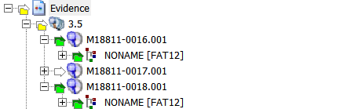

* Click the arrow for
the top of the hierarchy (Evidence) then click again to remove the selection to reset QuickPix. This will remove all files from
the File List.

#### File List  
-   Expand fields or hide fields that are not useful to you in the File List, which makes up the bottom half of the screen.

-   Click on any field in the File List to sort that field.

    -   Sort by hash (MD5, SHA1, or SHA256) to identify duplicates.

    -   Sort by Name to identify similar file names.

    -   Sort by Path to see the original arrangement on the disk images
        including which files were in a which folder.

    -   Sort Modified date to see date ranges.

-    Use the Category field instead of the Ext field when identifying formats if FTK does not recognize the correct extension.

#### File Content Window

* Highlight a file in the File List and FTK will attempt to
render the file in the File Content window Natural pane using an
internal file viewer.

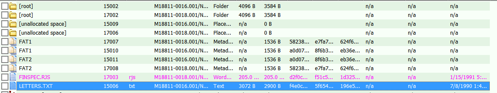

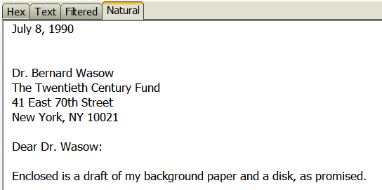

* View Hex, Text, and  Filtered tabs for lower-level interpretations of the file if FTK cannot render the file in Natural.  
    * Click the Hex tab to view a hexadecimal rendering of the file.
    * Click the Text tab to view the file as ASCII text with non-printable characters
as ".". 
    * Use the encoding drop-down to select an alternate
encoding. 
    * Click the Filtered tab to view text with non-printable characters ignored.  
    * Use the encoding drop-down to select an alternate
encoding. 

### Icons
Icons representing files indicate the type of file you are viewing.
* Folders  
  
* Slack Space  
  
* Deleted Files  
  
* File systems  
  
* Unknown formats  
  

### Icons to Watch Out for
In the normal course of events you shouldn’t see the following formats when you view files in FTK. Digital Archives staff apply profiles to FTK to keep from displaying Slack Space and Deleted files. If you see them please let us know before you proceed. We either need to review our work or identify the problem with the transfer. Unrecognized files systems and home video DVDs should be removed from FTK before you view files. DVDs are treated as AMI and not arranged as electronic records. Unrecognized file systems are most likely bad disks but might be in a format that requires emulation.


#### Stop and discuss with Digital Archives staff if you see…

* Slack Space  
  
* Deleted Files  
  
* Unrecognized file systems  
  
* DVDs
    * VIDEO_TS
* Seeing the above formats means something has gone awry
### Unviewable Formats
You should also stop and talk to us before proceeding if you see unviewable files that you think are in scope. There are many files that FTK designates as unknown. For many of these files you are still able to view the complete contents of the file in natural or filtered view. Those files can be arranged as usual. If you encounter files where you cannot see the complete contents in any view but think the files are in scope please discuss these files with digital archives staff. In the case of image files with no view in FTK like Canon RAW we can stage these images so you can view them with software outside of FTK. Another common example is Quark files. You can sometimes see limited text for Quark files in filtered view but you can’t view any images. Since we can only partially review these files we need to be aware of them if they are being arranged in packages for access.

#### Stop and discuss with Digital Archives staff if you see…
* Unknown formats with no Natural view and a limited Filtered view that are in scope  
  
* Files that you would like to view outside of FTK  
* Files that you cannot completely review  
  ## Out of Scope Formats
There are some file types that either can’t be exported from FTK or don’t provide useful information. These file types should not be bookmarked. Sometimes the presence of many temp or system files can be confusing for researchers, making it difficult to find files with content among the many temp files. Unless you have received specific instructions from Digital Archives staff to the contrary, don’t bookmark folders, Slack Space, deleted files, file systems, .DS_Stores, Resource Forks, Alternate Data Streams, temp files, desktop DB or Icons.
### Don't Bookmark
* Folders  
  
* Slack Space  
  
* Deleted Files  
  
* File systems  
  
* .DS_STORE
* Resource Forks  
  
* Alternate Data Streams  
  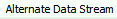
* temp files (~ or . in front)
* desktop DB
* Icon

### PII (Personal Identifiable Information)

* Please check to see if
    any files have the label "Potentially Sensitive" and review to see if they contain
    sensitive material.  
    * When digital archives staff uploaded the collection's files into
    FTK, they ran a search for Pii. If there were any hits, these
    files were labeled "Potentially Sensitive".

## Filters
Filters refine the File List to only display files within certain defined parameters. The result is similar to search filters but you only have to define the filters not a search. FTK comes with many default filters you can apply to the File List. Digital Archives staff have also created some filters to hide system files.

### Using Filters
This section describes how to
* Use filters to hide file types you shouldn’t bookmark
* Toggle filters to see what’s hidden
* Create compound filters
* View filter definitions
* Import filters

### Tips
* Bookmark with filters on
* Don’t include the Actual Files filter if you want to bookmarks files in Zip container

### [Importing a filter](Importing-a-filter){:target="_blank"}
This page demonstrates how to import a filter from the FTKsettings folder on the FREDs.
### [Filters and zips](Filters-and-Zips){:target="_blank"}
This page shows how the Actual Files filter deals with zips and files within zips. It demonstrates filters that will show files in zips that are available to import if you don’t see them in your collection. It displays what the File List looks like when a filter is active and how to toggle filters on and off.

### [Compound filters](Compound-filters)
This page shows how to use compound filters in FTK. compound filters are an option when available saved filters don't work and you don't want to create definitions from scratch. It displays the difference between applying different operations to the Include and Exclude box. It demonstrates how the File List looks when filters are active and how to toggle filters on and off.

### The Overview Tab


In the Overview tab files are organized based on their characteristics
rather than how they were organized when imaged. Below is the Overview
tab with the File Category node opened on the left and the File Status
node opened on the right. Highlight any node to actively display
the files in the File List window, which can then be viewed and 
filtered in the same manner as the Explore tab.

|   | 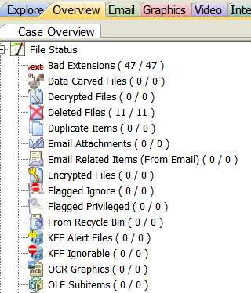 |
 
### Labeling

Labeling is a way of applying user-defined tags to files. It can be used
to group together files from anywhere in a collection that can later be
viewed on a single File List. 

* Highlight one or more files from the File List and click the
 button of 4 squares to use labels.


* Click the Manage Local button to create a new label in the current case.  
* Name the label and select a color.  

* Select the box for a label from the list in the Labels window.  
* Click OK to apply the label to a highlighted file.  


* View the files by label in the Overview tab or sort by label in the Explore tab.  

* Use labels to create new filters in the Filter
Manager.[](dapi/media/image21.png)

 

### Searching


FTK contains two tabs that are used for searching the collection, the
Live Search tab, and the Index Search tab.

#### Index Search

The index search is used to search the full-text index that FTK creates
when disk images or files are ingested into FTK.

* Look up terms in the index, highlight a term, and click Add.

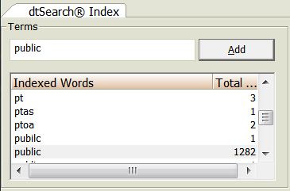

* Select And/Or Operators and click Search Now.


* Click Apply filter and Select a filter from the dropdown to apply a filter to results. Click OK.  
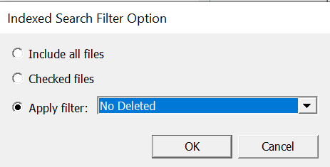
* Hits will display in the results window.


* Highlight hits to populate the File List.

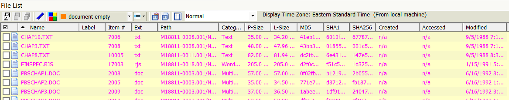

#### Live Search

The live search is a more advanced search used for searching across the
files in a collection. While more powerful, this search is processor heavy
and time consuming.

* The Live search has three modes: text, pattern, and hex.

##### Text Searching

* Enter text and click the Add button.  
* Enter a value (1) in Max Hits per File.  
* Select a filter from the dropdown next to Search Filter if you want to filter results.  
* Click the Search button.  
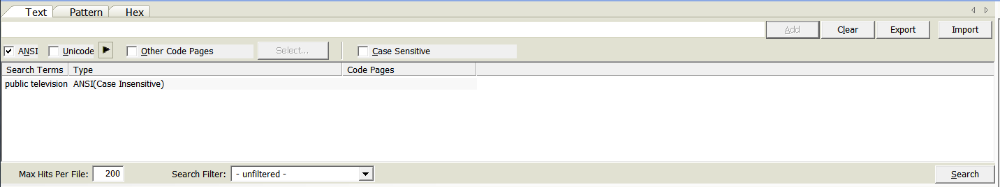

##### Pattern Searching
* Select the Pattern tab. 
* Click the white arrow to the right of the search bar to use preset regular expressions  
(phone
numbers, social security numbers, credit card numbers, etc.).


* Select a pattern from the menu to the right.  

* Click the Search button.  
* Hits will display in the results window.  
* Highlight hits to populate the File List.  

## Bookmarking

Bookmarks are a hierarchical organization system in FTK that you will use to create ER components. Bookmarks can be viewed in the bookmarks tab. Bookmarks are used to group together files into an intellectual component to be entered into Aspace. It is in a bookmark that the unit identifier, unit title, and date coverage will all be recorded.

#### Naming Conventions

There are currently two ways to enter ER components in ASpace. You can manually enter ERs in ASpace or Digital Archives staff can create a JSON export of the bookmarks. You must use the following conventions for JSON to be created correctly.

* Create Bookmarks with Series or Heading titles. These bookmarks have no files.
* Create ER bookmarks with files under Series/Heading bookmarks.

#### Creating Bookmarks

-   Create empty bookmarks to mimic the hierarchical structure of the finding aid.  
    * Right-click a top level bookmark in the Bookmarks tab and select 'Create empty bookmark'.  
    * Drag and drop bookmarks to place them in the hierarchy.  

-   Wait until
    you are finished processing to number your ER components.

#### Finalizing Bookmarks
* Enter the unit id, unit title, and date range of the files in the Bookmark Name field.  
* Bookmark Name: ER[space]number: Title, dates.  
  ```ER 5: Future of Public Television, 1992```


### [Creating a bookmark](Creating-a-bookmark){:target="_blank"}
This page displays how to create a bookmark from the Explore tab in FTK. It uses the naming convention that should be used for ERs. **Temporary titles can be used before bookmarks are finalized.**

### [Creating bookmark hierarchy](Creating-bookmark-hierarchy){:target="_blank"}
This page shows how to create a bookmark hierarchy using empty bookmarks to mirror your arrangement. You will need to create series or heading level bookmarks to use the ASpace import feature. The video also show you how to create a bookmark with files. It also demonstrates what happens when you delete a higher level bookmark. Everything below is deleted too!

### [Moving bookmarks and adding files](Moving-bookmarks-and-adding-files){:target="_blank"}
This page show you how to move bookmarks in a hierarchy. It also demonstrates how to create bookmarks and how to add files to an existing bookmark.

### Bookmark contents
When you have finished bookmarking, bookmarks should usually contain one level of files and no folders within it. Each bookmark with files in it should be a numbered ER. Series and Collection level bookmarks should not contain files.

* Numbered ERs should contain 1 level of files only and no folders
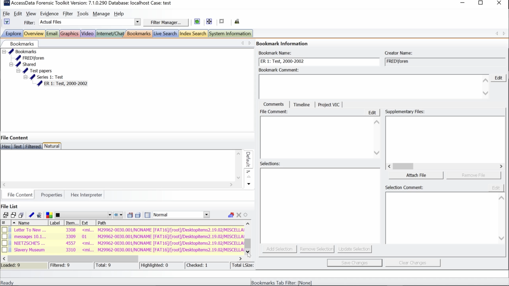

### Exceptions
Here are exceptions to the guidelines above. 

#### Disk Images
Although I have said that file systems should not be bookmarked, We may ask you to bookmark file systems if we need to create disk image packages for access. We should check-in and have a conversation about arrangement before you create bookmarks to represent DI packages.

* Do bookmark file systems if digital archives staff say to create DI packages

#### Folders
It’s also possible that we will encounter cases where folder structure needs to be retained for access in specific software. This is also a case where we will need to have a conversation before you create bookmarks with folders. Digital Archives staff will need to know the folder structure you need. Creating the right folder structure requires manipulating options in FTK. The correct folder structure may not be possible to achieve with FTK in many cases. Ideally, when a specific folder structure is needed it will be created from a transfer outside of FTK. This is much easier. When you find you need to retain recursive folders this work should usually done at an archivist workstation.

* Retaining a folder structure to view files in specific software 
  * (AV projects, website backends)
* Discuss folder structure with Digital Archives staff 
* Make sure DA staff are aware folders will be retained before export
* Retaining folder structure across a collection
  * Arrange files at archivist workstation if you need recursive folders
  * More that 1 ER folder containing files per ER

#### Folder Export options
The options available for folder export in FTk to export the entire path down to the media container (data folder of MediaID) or retaining a bookmarked folder. Even if a folder within the bookmarked folder isn’t bookmarked it will be exported along with the bookmarked folder.

* Original path
  * All folders including data or MediaID
* Bookmarked folder and all folders within

#### Options for arrangements with folders
When you want to retain folders in your arrangement you have 3 options. This arrangement is easiest outside of FTK so even if the collection is loaded in FTK you may want to discuss this option with Digital Archives staff. 
You can arrange the contents of each folder as a separate ER. This is the easiest to do in FTK because it conforms to FTK’s defaults.
You can discuss exporting folders in FTK with Digital Archives staff. Remember you can only choose to retain an entire file path from the MediaID or you can choose to retain a folder and everything in it. You can’t exclude any content from folders with these options.

* Arrange folders outside of FTK
* Arrange the contents of each folder as an ER (ER 1, ER 2)
* Discuss exporting folders in FTK with Digital Archives staff

### Deaccessions

* Select the Bookmarked filter.  
* Select each media object in the evidence items window one by one.  
* Note media objects with no files present.  

OR

* Select the Bookmarked filter and sort the File List by path.  
* Note MediaIDs that don't appear in the File List.  

* Keep media objects that contain executables served as a disk image.

## De-duplicating Collections

### Running a De-duplication Job

* Select Additional Analysis from
the Evidence menu. 

* Select Flag Duplicate Files from the File Hashes group and click OK.


* This will start a comparison of the checksums of all files in the
collection.

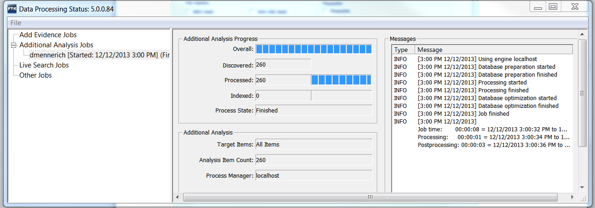

* When complete close the Data Processing window.

### Adding a Duplicate File Column Set to a FTK Case

* Click the column
settings button from the File List window.  
* Click the import button and navigate to Storage(F:)\\FTKsettings\\ColumnDefs\\Duplicates.xml  
* Click OK and close the column settings window.

* Select Duplicates from the column dropdown.


### Reading the Duplicate File Field
* Note the Duplicate File field in the File List.  
* Note the number in the Duplicate File field.  


* If the Duplicate File field is blank the file has not been analyzed
for duplication.

* 1 indicates the file is duplicated but it is the first instance of that file hashed in the case.  
* 2 indicates the file is a duplicated and not the first instance of that file hashed in the case.  
* 3 indicates the file is unique and does not have a duplicate in the collection.  

### Adding a Duplicate Filter

* Click the import filter button from the Filter Manager
  
* Navigate to Storage(F:)\\FTKsettings\\FilterDefs\\DuplicateSecondary.xml  
* Click open and OK to import it into the case.  
* Use the filter to either include or exclude secondary
duplicates from the File List.  

Example: File list **excluding** secondary duplicates.
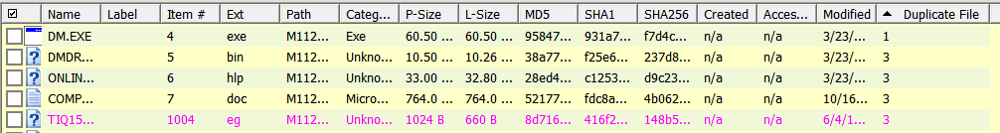

Example: File list **including** only secondary data sets.
