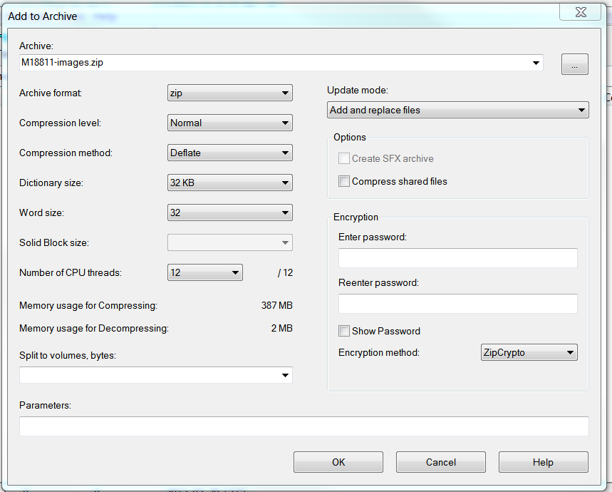
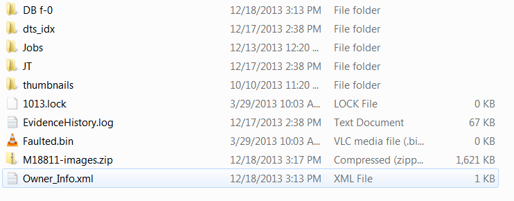
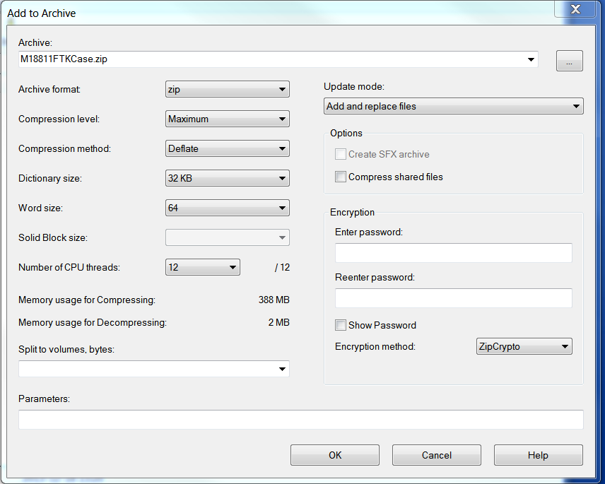

# FTK Case Removal
{: .no_toc }
Instructions
{: .no_toc .text-delta }
## Case archiving

When the processing of a collection is complete, its case files,
evidence files, and database in Forensic Toolkit need to be aggregated into a single
directory and backed-up to storage. The FTK manual calls this process archiving. Before you begin
archiving a case, first reference the [FTK Archive
Policy](/staging/FTK-Backups-and-Archive-Policy.html){:target="_blank"}
and speak to the Digital Archives Assistant to determine whether this collection
will be archived according to the policy or if an exception will be
made. If an exception is to be made, you will be provided with a
README.txt template to include in the case.

## Archiving a case

* Right-click on the completed collection from the FTK main menu.
 Point to Backup and  click Archive and detach. Click OK in the popup window. This will perform an SQL dump of the
 collection database into its case folder (archive) and remove all
 collection related data from the FTK database (detach). The directory
 will be named 'DB f-0'.

* Open 7Zip manager from the desktop. Navigate to the evidence
 directory on the FRED. Highlight the collection you are working
 on and click the plus button to bring up the compression dialog.


* Add "-evidence" to the file name in the Archive field, then click start to Zip
 the evidence directory. Use the following settings.  
 Archive format: zip  
 Compression level: Normal  
 Compression method: Deflate  
 Dictionary size: 32 KB  
 Word size: 32  
 Number of CPU threads: 12  




* Cut and paste the evidence zip into the case directory. The contents of the case directory should resemble:



* Create a zip of the case folder using 7Zip manager.
 Name the file ```[collId]FTKCase.zip```.



* Open the archived directory and find the
 appropriate folder for the current year and quarter. The folder naming
 convention is yearQ\# (e.g. 2016Q1). Copy and paste the zipped case
 into this folder.


|  --- | -------------------- |
| Q1 |  January - March |
| Q2 | April - June |
| Q3  | July - September |
|  Q4  | October - December |

 **If the case being archived has an exception to the retention
 policy, open the archived directory and find
 the folder labeled ```archived\FTK\version``` (e.g. ```archived\FTK\5.6```)
 and cut and paste the zipped case here.**

 * Delete the following:

    -   The collection directory in Cases 

    -   The collection directory in Evidence

    -   The collection directories in Backups  