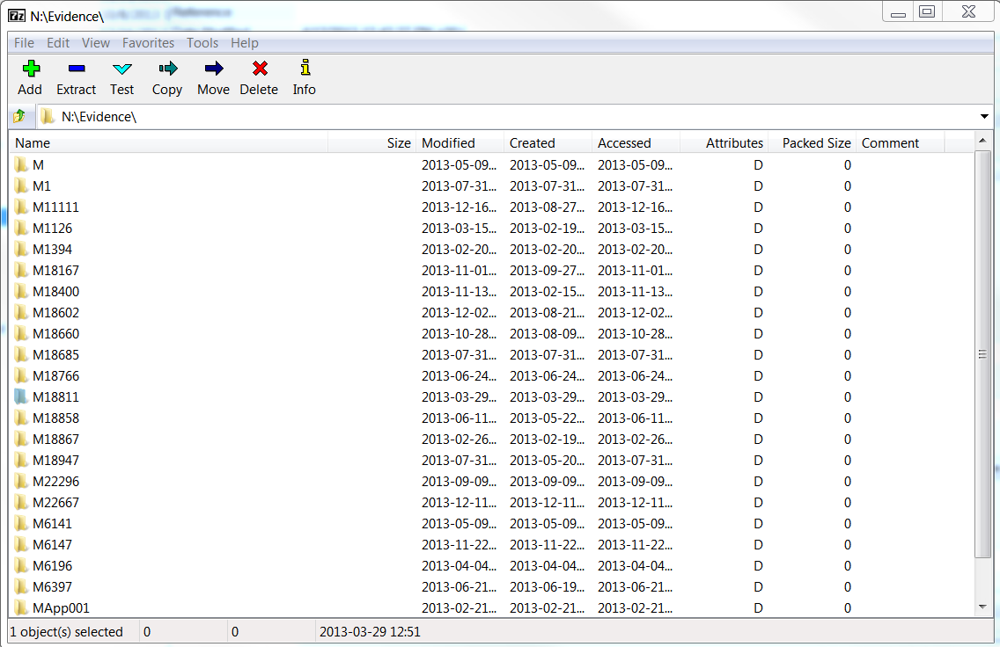

# FTK Case Removal
{: .no_toc }
&nbsp;
{: .no_toc .text*delta }
## Case archiving

When the processing of a collection is complete, its case files,
evidence files, and database in Forensic Toolkit need to be aggregated into a single
directory and backed-up to storage. The FTK manual calls this process archiving. Before you begin
archiving a case, first reference the [FTK Archive
Policy](/staging/FTK-Backups-and-Archive-Policy.html){:target="_blank"}
and speak to Digital Preservation staff to determine whether this collection
will be archived according to the policy or if an exception will be
made.  

## Archiving a Case in FTK

* Right-click on the completed collection from the FTK main menu.  
* Point to Backup and click Archive and detach.  
* Click OK in the popup window.  
(This will perform an SQL dump of the
 collection database into its case directory (archive) and remove all
 collection related data from the FTK database (detach). The directory
 will be named 'DB f-0'.)

## Compressing the Evidence Directory

* Open 7Zip manager from the desktop.  
* Navigate to the evidence directory on the FRED. Storage(F:)\\Evidence\\\[CollectionID\]  
* Highlight the collection you are working on and click the plus button.



* Add "-evidence" to the file name in the Archive field  
* Click the ... button and navigate to the case directory H:\\cases\\CollectionID  
Use the following settings.  
 Archive format: zip  
 Compression level: Normal  
 Compression method: Deflate  
 Dictionary size: 32 KB  
 Word size: 32  
 Number of CPU threads: 12  


* The contents of the case directory should resemble:


## Managing Quarterly Directories  

* Make sure a directory exists for the current year and quarter in Storage(F:)\\Archived Cases.  
* The directory naming convention is yearQ\# (e.g. 2016Q1).  

|  --- | -------------------- |
| Q1 |  January - March |
| Q2 | April - June |
| Q3  | July - September |
|  Q4  | October - December |

## Compressing the Case Directory

* Create a zip of the case directory using 7Zip manager.
 Name the file ```[collId]FTKCase.zip```.  
* Click the ... button and navigate to the appropriate directory for the current year and quarter. Storage(F:)\\Archived Cases  


## Deleting Directories   
 * Delete the following:

    -   The collection directory in Cases 

    -   The collection directory in Evidence

    -   The collection directories in Backups  