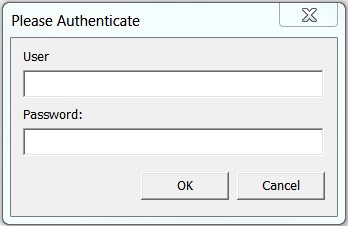
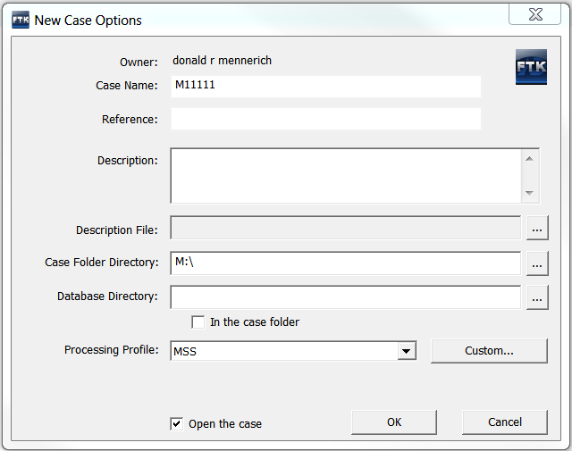
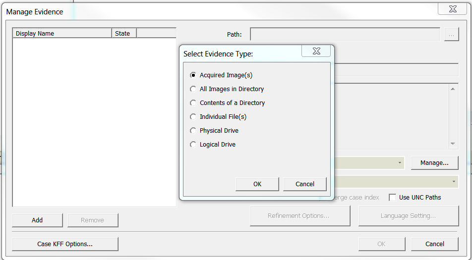
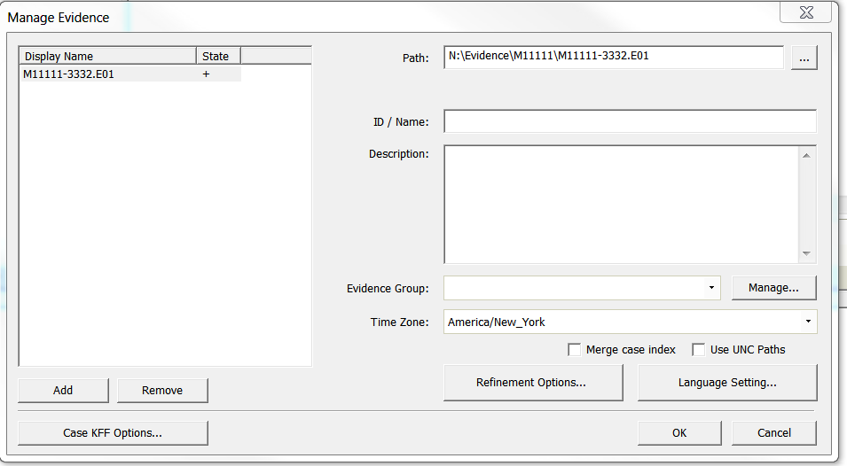
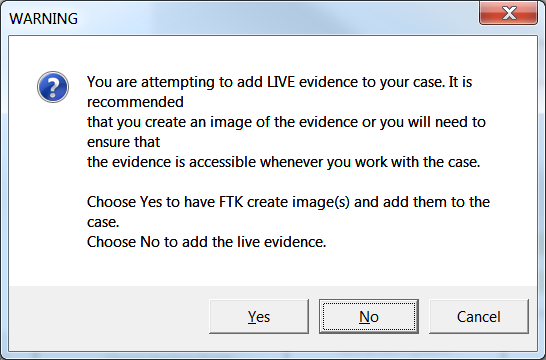
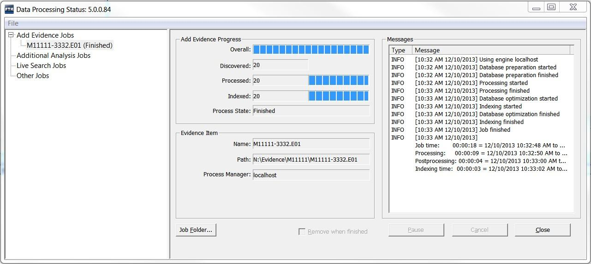

# Loading evidence into FTK  

{: .no_toc }
Instructions
{: .no_toc .text-delta }
* Create a directory with the CollectionID of the collection you are adding to FTK in the FTK evidence directory.  
```N:\Evidence\[CollectionID]```  

* Copy bags and disk images from Staging to the FTK evidence directory.  

* Remove bag metadata from the evidence directory bags.  

**Make sure the FTK license USB is inserted in the FRED before opening FTK.**  

* Launch the FTK Application from the desktop.

 

* Log into the FTK database.

 


* For new cases, create a new case by selecting new from the Case menu.   

* Enter the ID of the collection into the 'Case Name' field and
 set the 'processing Profile' drop-down to 'MSS', then click OK.  
 ```CollectionID Collection name```  
 ```M24017 Builders Association records```   



* For existing cases, double-click the name of the case from the menu.  

* Select 'Add/Remove...' from the Evidence menu. Click the
 'Add' button.  

 

* To add a single image or to choose images in a directory
 make sure 'Acquired Image(s)' is selected from the radio buttons in
 the 'Select evidence type' pop-up. Click OK.

<!-- Check removal of images in a directory and adding higher level dir for bags.
* To add all the images for a collection select the 'All Images
 in a Directory' radio button in the 'Select evidence type' pop-up,
 then click OK. -->

* To add extracted files select the 'Contents of a Directory'
 radio button in the 'Select evidence type' pop-up. Click OK.

* Navigate to the image file(s) or
 directories you are adding to the case from the
 N:\\Evidence\\\[CollectionID\] directory using the file browser and click 'open'. You can add multiple images or directories to a case.  

 

**Note: Add only the first file when images are split into multiple files
(M11111-4444.E01, M11111- 4444.E02 etc). FTK will automatically load the rest of the files from the evidence folder.**  


* When adding directories a pop-up dialog will caution that you
 are adding Live Evidence and ask whether to create images of the
 evidence. Click NO!

 

* Adjust the Time Zone (if known) for the image. Click
 the 'OK' button

 

* Check for and label potentially personal information (PII).

* Navigate to the Live Search and select the Pattern tab.  

* The search patterns listed below are saved to FTK Live Search. Select the saved search. Click Search.   

* To add search patterns copy and paste the patterns below individually. Click the Add button each time. Click Search. This way, you can add multiple search patterns into one search.  
  

| Type of PII            | Search Patterns                                 |
| ------------------------ | ---------------------- |  
| Social Security Numbers | \\\<\\d{3}\[\\-\\s\]?\\d{2}\[\\-\\s\]?\\d{4}\> |
| Credit Card Numbers     | \\\<(\\d{3}\[\\-\\s\]?){3}\\d\\d\\d\\d\\\> | 
| Credit Card Numbers     | \\\<\\d{4})\[\\-\\s\]?\\d{6}\[\\-\\s\]?\\d{5}\> |  


        
         

* The results will appear in the right hand pane if there are matches. Click
on the plus sign and select all matches in the File Viewer on the
left. Label these matches "Potentially Sensitive."
