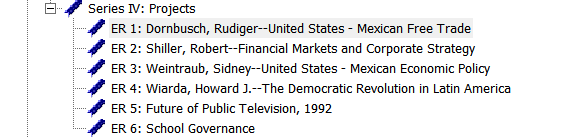
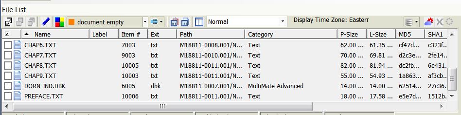
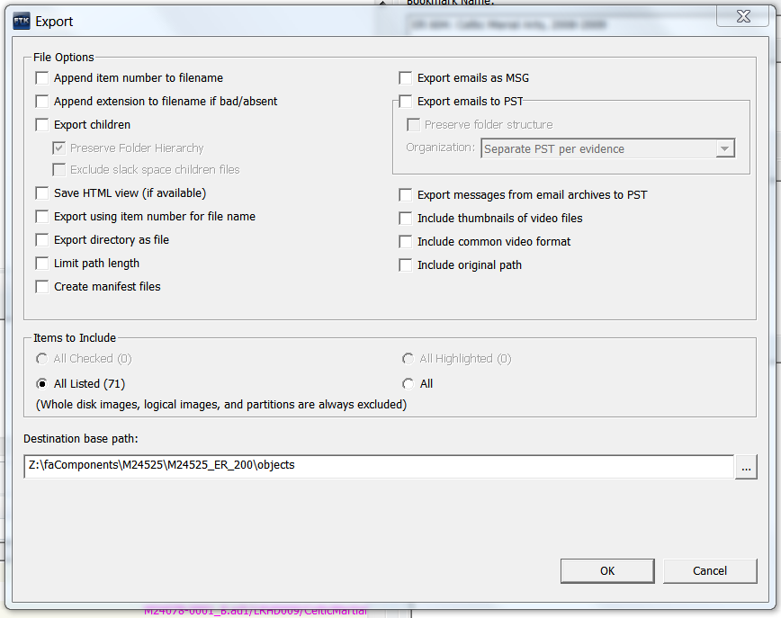
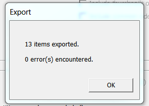
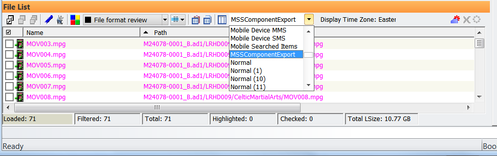
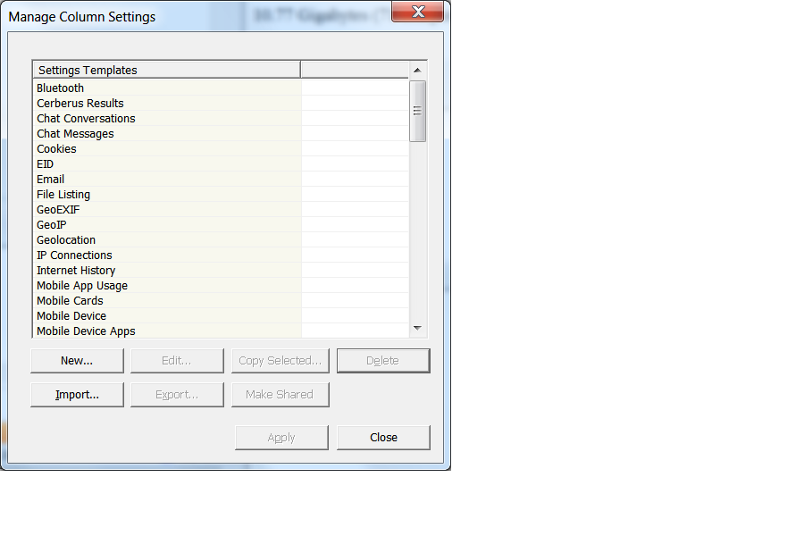
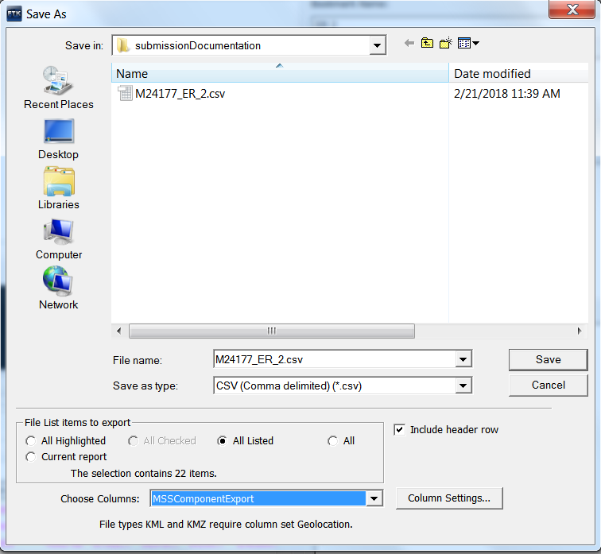

# Exporting Finding Aid Components From FTK

{: .no_toc }
&nbsp;
{: .no_toc .text*delta }
When a finding aid has been approved and the Bookmarks have been reviewed the contents of Bookmarks need to be exported to Digital Archives storage.  
## Create Finding Aid Component Folders  
* Open the case for the collection and navigate to the Bookmark
tab.  
* Note how many finding aid components you have in the Bookmarks.  
* Open the WSL terminal  and navigate to the mount point directory by entering ```cd /mnt```

* Any mounted drives should be accessible from the mount point directory. Drives you'll see in /mnt include:
  * d - Sata Drive Bay
  * f - Storage for FTK
  * h - Open FTK cases
  * i - Codemeter access key
  * y - DigArchDiskStation

* If the Y:\ drive is not visible in /mnt or /mnt/y appears to be empty then re-mount:
  * Change to the top level directory by entering ```cd /```
  * Enter the command ```sudo mount -t drvfs Y: /mnt/y```  

```$ cd /mnt/y/Staging/faComponents```

```$ mkdir -p CollectionID/CollectionID_ER_{first..last}/{metadata/submissionDocumentation,objects}```  
* Change first to the number to begin making folders on and last should be
the number to end on.


## Export Files  
* Highlight the bookmark that you want to export the files from.



* Select Export from the File menu.  

Or  

* Right-click any file in the File List and select
Export.

* Select All Listed in the Export window from Items to Include.  
* Navigate to the finding aid component you are working on under Destination base path  
(Example: ```Y:\FAComponents\M24177\M24177_ER_1\objects```).  
* Click "OK."

<!--  -->

* When the export is complete you will see the following window. Click OK.




## Export Metadata  
* Import MSSComponentExport column template if not present.
* Check the column dropdown in the File List window.  
(The MSSComponentExport template will appear as below if imported.)



* Click the column icon to the left of the dropdown if the template is not in the column dropdown.  
* Click Import.  



* Navigate to ```Storage(F:)\FTKsettings\MSSComponentExport.XML```. Click Open.


* Click OK at the next dialog and Close on the following dialog.  
* Select MSSComponentExport from the column dropdown.  
* Select Export File List Info from the File menu.  

Or  

* Right-click on any file from the File List and select
Export File List Info.  
* Navigate to the metadata
folder in the Export window.  
(Example: ```Y:\FAComponents\M24177\M24177_ER_2\metadata```)  
* Enter the bookmark name in the File name
field and select CSV from the Save as type field.  
(Example: ```M24177_ER_2```)  
* Select All Listed from the File List items to export pane.  
* Select "MssComponentExport" from the Choose Columns field. Click Save.  

