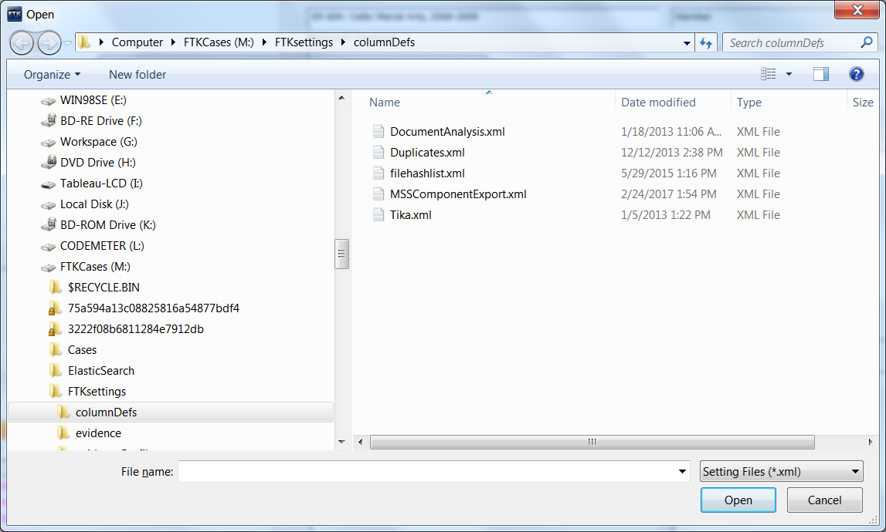

# Exporting Finding Aid Components From FTK

{: .no_toc }
Instructions
{: .no_toc .text-delta }

* Open the case for the collection and navigate to the Bookmark
tab. Note how many finding aid components you have in the Bookmarks.
Open Cygwin and enter the following commands to build your folders:  

```$ ssh archv```

```$ cd /Volumes/Staging/faComponents```

```$ mkdir -p CollectionID/CollectionID_ER_{first..last}/{metadata/submissionDocumentation,objects}```  
* Change first to the number to begin making folders on and last should be
the number to end on.

* Highlight the bookmark that you want to export the files from.


* Select Export from the File menu.  

Or  

* Right-click any file in the File List and select
Export.

* Select All Listed in the Export window from Items to Include
and navigate to the finding aid component you are working on under Destination base path (Example: ```Z:\FAComponents\M24177\M24177_ER_1\objects```). Click "OK."


* When the export is complete you will see the following window. Click OK.


* Import MSSComponentExport column template if not present.

* Check the column dropdown in the File List window. The
MSSComponentExport template will appear as below if imported.


* Click the column icon to the left of the dropdown if the template is not in the column dropdown. Click Import.


* Navigate to ```M:\FTKsettings\columnDefs\MSSComponentExport.XML```. Click Open.



* Click OK at the next dialog and Close on the following dialog.
Select MSSComponentExport from the column dropdown.

* Select Export File List Info from the File menu.  

Or  

* Right-click on any file from the File List and select
Export File List Info. 

* Navigate to the metadata
folder (Example: ```Z:\FAComponents\M24177\M24177_ER_2\metadata```) in the Export window. 

* Enter the bookmark name (Example: ```M24177_ER_2```) in the File name
field and select CSV from the Save as type field. Select All Listed
from the File List items to export pane and "MssComponentExport" from
the Choose Columns field. Click Save.

