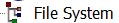

# FTK Introduction
{: .no_toc }
&nbsp;
{: .no_toc .text*delta }

<iframe src="https://docs.google.com/presentation/d/e/2PACX-1vRJWXlVF6S3ZAhj6MQjn96gXtX9wXB9rJB1IZTu8cU5-QhpMCoTF9yoVlOa4i1WY29MPioMcuy_9Kl-/embed?start=false&loop=false&delayms=3000" frameborder="0" width="960" height="569" allowfullscreen="true" mozallowfullscreen="true" webkitallowfullscreen="true"></iframe>

# Working with Electronic records

## Objectives
This page describes
* Workflow steps
* When to contact Digital Archives staff
* Minimum requirements for electronic records survey
* Symbols used in FTK
* How to apply, remove, and create filters
* How to create bookmarks

## Overview
These are the basic steps for working with Electronic records that Archival Processing and Digital Archives will work on together.
* You are assigned a collection with Electronic records.
* Survey Electronic records and include them in the project proposal.
* Confirm whether you will use FTK to process the collection.
* Sign up to use a FRED workstation on the Digital Archives Lab Calendar.
* Label files.
* Bookmark files.
* Bookmark review by Digital Archives staff.
* ArchivesSpace import by Digital Archives and Manager, Archival Metadata.

## Communicating with Digital Archives staff
Send email to digitalarchives@nypl.org when
* You are assigned a collection with Electronic records.
    * Be clear about where you are in processing when you contact Digital Archives.
* You have completed your processing proposal.
* You find digital media in a collection.
* You sign up for time on the Digital Archives Lab calendar. 
    * At least 24 hours in advance
* You are ready to begin bookmarking.
* You are done bookmarking.
* You have completed any revisions suggested by Digital Archives staff.  

## Beginning Work with Electronic records
### Collection Assigned
* Review the collection for Electronic records.
* Send an email to digitalarchives@nypl.org and let us know the project timeframe.

### Survey
* Include electronic records in your initial survey for the project proposal.
* Read media labels to get an idea of the contents, at minimum.
* View hard drive contents with a write-blocker if files aren’t transferred.
* You may have the option to conduct the initial survey in FTK if files are transferred.
* Use labels instead of bookmarks in the initial survey.

## Preparing to Process

* [Reserve your FTK session](../using/using-lab-equipment#reserving-a-workstation-session) at least 24 hours in advance.
* Click the FTK icon to open FTK and begin your session. 
* Select your collection from the bar on the left hand side of the screen.  
**Information in the media log can assist with processing.**
* Open CMS and navigate to the collection's media log when appropriate.  

### Appraisal
Spend some time evaluating the electronic records before you begin bookmarking. You'll be using the same strategies you use for paper records for the most part but FTK has appraisal tools you should use as well.

### Icons
Icons representing files indicate the type of file you are viewing.
* Folders  
  
* Slack Space  
  
* Deleted Files  
  
* File systems  
  
* Unknown formats  
  

### Icons to Watch Out for
In the normal course of events you shouldn’t see the following formats when you view files in FTK. Digital Archives staff apply profiles to FTK to keep from displaying Slack Space and Deleted files. If you see them please let us know before you proceed. We either need to review our work or identify the problem with the transfer. Unrecognized files systems and home video DVDs should be removed from FTK before you view files. DVDs are treated as AMI and not arranged as electronic records. Unrecognized file systems are most likely bad disks but might be in a format that requires emulation.

#### Stop and discuss with Digital Archives staff if you see…

* Slack Space  
  
* Deleted Files  
  
* Unrecognized file systems  
  
* DVDs
    * VIDEO_TS
* Seeing the above formats means something has gone awry
### Unviewable Formats
You should also stop and talk to us before proceeding if you see unviewable files that you think are in scope. There are many files that FTK designates as unknown. For many of these files you are still able to view the complete contents of the file in natural or filtered view. Those files can be arranged as usual. If you encounter files where you cannot see the complete contents in any view but think the files are in scope please discuss these files with digital archives staff. In the case of image files with no view in FTK like Canon RAW we can stage these images so you can view them with software outside of FTK. Another common example is Quark files. You can sometimes see limited text for Quark files in filtered view but you can’t view any images. Since we can only partially review these files we need to be aware of them if they are being arranged in packages for access.

#### Stop and discuss with Digital Archives staff if you see…
* Unknown formats with no Natural view and a limited Filtered view that are in scope  
  
* Files that you would like to view outside of FTK  
* Files that you cannot completely review  
  ## Out of Scope Formats
There are some file types that either can’t be exported from FTK or don’t provide useful information. These file types should not be bookmarked. Sometimes the presence of many temp or system files can be confusing for researchers, making it difficult to find files with content among the many temp files. Unless you have received specific instructions from Digital Archives staff to the contrary, don’t bookmark folders, Slack Space, deleted files, file systems, .DS_Stores, Resource Forks, Alternate Data Streams, temp files, desktop DB or Icons.
### Don't Bookmark
* Folders  
  
* Slack Space  
  
* Deleted Files  
  
* File systems  
  
* .DS_STORE
* Resource Forks  
  
* Alternate Data Streams  
  
* temp files (~ or . in front)
* desktop DB
* Icon

<!-- slide 15 -->