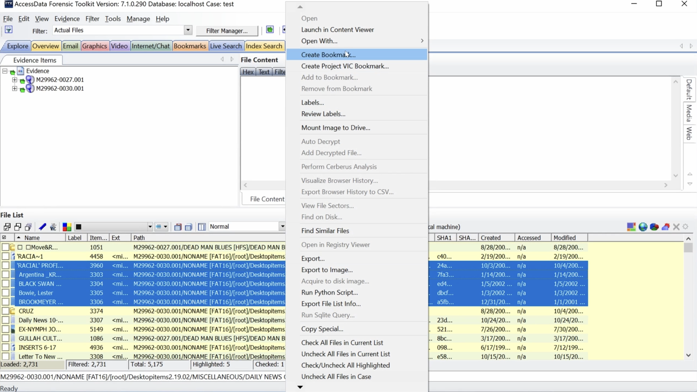
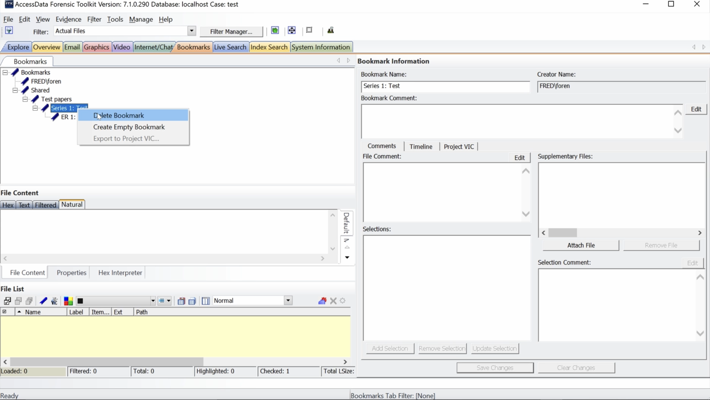

# FTK Introduction

<iframe src="https://docs.google.com/presentation/d/e/2PACX-1vRJWXlVF6S3ZAhj6MQjn96gXtX9wXB9rJB1IZTu8cU5-QhpMCoTF9yoVlOa4i1WY29MPioMcuy_9Kl-/embed?start=false&loop=false&delayms=3000" frameborder="0" width="960" height="569" allowfullscreen="true" mozallowfullscreen="true" webkitallowfullscreen="true"></iframe>

1. TOC
{:toc}

# Working with Electronic records

## Objectives
This page describes
* Workflow steps
* When to contact Digital Archives staff
* Minimum requirements for electronic records survey
* Symbols used in FTK
* How to apply, remove, and create filters
* How to create bookmarks

## Overview
These are the basic steps for working with Electronic records that Archival Processing and Digital Archives will work on together.
* You are assigned a collection with Electronic records.
* Survey Electronic records and include them in the project proposal.
* Confirm whether you will use FTK to process the collection.
* Sign up to use a FRED workstation on the Digital Archives Lab Calendar.
* Label files.
* Bookmark files.
* Bookmark review by Digital Archives staff.
* ArchivesSpace import by Digital Archives and Manager, Archival Metadata.

## Communicating with Digital Archives staff
Send email to digitalarchives@nypl.org when
* You are assigned a collection with Electronic records.
    * Be clear about where you are in processing when you contact Digital Archives.
* You have completed your processing proposal.
* You find digital media in a collection.
* You sign up for time on the Digital Archives Lab calendar. 
    * At least 24 hours in advance
* You are ready to begin bookmarking.
* You are done bookmarking.
* You have completed any revisions suggested by Digital Archives staff.  

## Beginning Work with Electronic records
### Collection Assigned
* Review the collection for Electronic records.
* Send an email to digitalarchives@nypl.org and let us know the project timeframe.

### Survey
* Include electronic records in your initial survey for the project proposal.
* Read media labels to get an idea of the contents, at minimum.
* View hard drive contents with a write-blocker if files aren’t transferred.
* You may have the option to conduct the initial survey in FTK if files are transferred.
* Use labels instead of bookmarks in the initial survey.

## Preparing to Process

* [Reserve your FTK session](../using/using-lab-equipment#reserving-a-workstation-session) at least 24 hours in advance.
* Click the FTK icon to open FTK and begin your session. 
* Select your collection from the bar on the left hand side of the screen.  
**Information in the media log can assist with processing.**
* Open CMS and navigate to the collection's media log when appropriate.  

### Appraisal
Spend some time evaluating the electronic records before you begin bookmarking. You'll be using the same strategies you use for paper records for the most part but FTK has appraisal tools you should use as well.

### Icons
Icons representing files indicate the type of file you are viewing.
* Folders  
  
* Slack Space  
  
* Deleted Files  
  
* File systems  
  
* Unknown formats  
  

### Icons to Watch Out for
In the normal course of events you shouldn’t see the following formats when you view files in FTK. Digital Archives staff apply profiles to FTK to keep from displaying Slack Space and Deleted files. If you see them please let us know before you proceed. We either need to review our work or identify the problem with the transfer. Unrecognized files systems and home video DVDs should be removed from FTK before you view files. DVDs are treated as AMI and not arranged as electronic records. Unrecognized file systems are most likely bad disks but might be in a format that requires emulation.

#### Stop and discuss with Digital Archives staff if you see…

* Slack Space  
  
* Deleted Files  
  
* Unrecognized file systems  
  
* DVDs
    * VIDEO_TS
* Seeing the above formats means something has gone awry
### Unviewable Formats
You should also stop and talk to us before proceeding if you see unviewable files that you think are in scope. There are many files that FTK designates as unknown. For many of these files you are still able to view the complete contents of the file in natural or filtered view. Those files can be arranged as usual. If you encounter files where you cannot see the complete contents in any view but think the files are in scope please discuss these files with digital archives staff. In the case of image files with no view in FTK like Canon RAW we can stage these images so you can view them with software outside of FTK. Another common example is Quark files. You can sometimes see limited text for Quark files in filtered view but you can’t view any images. Since we can only partially review these files we need to be aware of them if they are being arranged in packages for access.

#### Stop and discuss with Digital Archives staff if you see…
* Unknown formats with no Natural view and a limited Filtered view that are in scope  
  
* Files that you would like to view outside of FTK  
* Files that you cannot completely review  
  ## Out of Scope Formats
There are some file types that either can’t be exported from FTK or don’t provide useful information. These file types should not be bookmarked. Sometimes the presence of many temp or system files can be confusing for researchers, making it difficult to find files with content among the many temp files. Unless you have received specific instructions from Digital Archives staff to the contrary, don’t bookmark folders, Slack Space, deleted files, file systems, .DS_Stores, Resource Forks, Alternate Data Streams, temp files, desktop DB or Icons.
### Don't Bookmark
* Folders  
  
* Slack Space  
  
* Deleted Files  
  
* File systems  
  
* .DS_STORE
* Resource Forks  
  
* Alternate Data Streams  
  
* temp files (~ or . in front)
* desktop DB
* Icon

## Filters
Filters refine the File List to only display files within certain defined parameters. The result is similar to search filters but you only have to define the filters not a search. FTK comes with many default filters you can apply to the File List. Digital Archives staff have also created some filters to hide system files.

### Using Filters
This section describes how to
* Use filters to hide file types you shouldn’t bookmark
* Toggle filters to see what’s hidden
* Create compound filters
* View filter definitions
* Import filters

### Tips
* Bookmark with filters on
* Don’t include the Actual Files filter if you want to bookmarks files in Zip container

### Importing a filter
This video demonstrates how to import a filter from the FTKsettings folder on the FREDs.

https://user-images.githubusercontent.com/34036628/205160392-6c51f433-b038-4303-9576-6b464ce22494.mov

Click Filter Manager

Select funnel icon second from right on bottom left of Filter Manager

A File Explorer window should pop up. Navigate to Storage/FTKsettings/filterDefs.

Select a filter to import. Click Open.

A dialog box should say “imported successfully”. Click OK.

The imported filter now appears in the Filters list.

### Filters and Zips
This video shows how the Actual Files filter deals with zips and files within zips. It demonstrates filters that will show files in zips that are available to import if you don’t see them in your collection. It displays what the File List looks like when a filter is active and how to toggle filters on and off.

[Filters and Zips video](https://photos.google.com/share/AF1QipMe0i8RKiXa6S6d24oEmIAue5mi1W0waDEwUa9xZn-8-MNPScb_uC_iMJBZc3KF6w/photo/AF1QipNDUeanIjOb81s0OF2jYjKLHBk2QeAkrSe8l4Wm?key=bTlGQkVoaFFpbGlna2dvYjN0NzZkbkxPNVhoaTRn){:target="_blank"}

FTK can display files within Zip containers. But using Actual Files filter hides files in Zips.

Click Filter Manger.

Check default and imported filters for Actual Files. Select a filter.

Click Define.

Note Operators: Matches, Criteria: Actual Files. This filter only displays actual files.

File List displays yellow when a filter is on. Note Zip is displayed not .doc files within.

Click funnel in upper left corner to toggle filter off.

With the filter off File List displays .doc files within Zip container.  
Click Filter Manger.

Select a filter with “include zip extracted”. See import filter for more filters.

Note Actual Files does not appear in filter Rules Criteria.

Files within Zip container (.doc files) appear while filter is on. Yellow File List shows filter is on.

### Compound Filters
This video shows how to use compound filters in FTK. compound filters are an option when available saved filters don't work and you don't want to create definitions from scratch. It displays the difference between applying different operations to the Include and Exclude box. It demonstrates how the File List looks when filters are active and how to toggle filters on and off.

[Compound Filters video](https://drive.google.com/file/d/11bVINkx6spY1pBOKfaSG0JJbWPjgUa8Y/view?usp=share_link){:target="_blank"}

#### Include

Click Filter Manager

Select a filter from the Filters list. Click on the right arrow button next to Include box.

The selected filter is applied to Include. Select Define to view filter Rules.

Note Operators Is.

Check Filter Definition for filter no resource fork. Note Operator Does Not Start with. Click Close.

Click right arrow button next to Include box to apply no resource fork filter to Include.

Note that folders are displayed when the compound filter is on.

Click funnel icon on upper left to toggle filter off.

#### Exclude

Click Filter Manager

Select Folders filter. Click left arrow button next to Include box.

Select Folders filter. Click right arrow button next to Exclude box.

Folders filter is now applied to Exclude.

Note Folders are now hidden with filter applied.

Click funnel icon in upper left corner to toggle filter off. Folders are now displayed.

## Bookmarking

### Creating a bookmark
This video displays how to create a bookmark from the Explore tab in FTK. It uses the naming convention that should be used for ERs.

[Creating a bookmark video](https://drive.google.com/file/d/10BX1o5gLxuRnLFSqpCWYEyYqHLQupjH-/view?usp=share_link){:target="_blank"}

Highlight a range of files by selecting the first file, holding down shift, and selecting the last file.

Right Click. Select Create Bookmark.

Type Bookmark name in top left box. ER[space]number: Name, dates

Select Shared under Select Parent Bookmark. The bookmark will appear under Shared.

Select Bookmarks tab. The bookmark appears under Shared, the selected parent bookmark.

### Creating bookmark hierarchy
This video shows how to create a bookmark hierarchy using empty bookmarks to mirror your arrangement. You will need to create series or heading level bookmarks to use the ASpace import feature. The video also show you how to create a bookmark with files. It also demonstrates what happens when you delete a higher level bookmark. Everything below is deleted too!

[Creating bookmark hierarchy video](https://drive.google.com/file/d/10kCKq8isX9qJqYXbsJeVx09HeEtOfIq1/view?usp=share_link){:target="_blank"}

#### Create empty bookmark

From Bookmarks tab, select parent bookmark, Shared.

Right click. Select Create Empty Bookmark.

Type bookmark name in Name box. Click OK.

Select bookmark you just created, Test papers. Right click. Select Create Empty Bookmark.

Type bookmark name in Name box. Click OK.

#### Create bookmark with files

Click Explore tab. Now create a bookmark with files.

Highlight a range of files by selecting the first file, holding down shift, and selecting the last file.

Right Click. Select Create Bookmark.

Type bookmark name in Bookmark Name box. Select parent bookmark, Series 1: Test. Click OK.

#### Delete bookmark

To delete a bookmark, select bookmark from Bookmarks tab. Right Click. Select Delete Bookmark.

The bookmark and all bookmarks below are deleted.

### Moving bookmarks and adding files
This video show you how to move bookmarks in a hierarchy. It also demonstrates how to create bookmarks and how to add files to an existing bookmark.

[Moving bookmarks video](https://drive.google.com/file/d/11Pa9h6YkXFldyZ2SNgxJ9WhcbV8uXpl4/view?usp=share_link){:target="_blank"}

#### Moving bookmarks

From Bookmarks tab, Select Bookmark, hold, and drag to move.

Note bookmark now appears below based on the direction it was moved.

#### Adding files to existing bookmark

Click Explore tab. To add files to a bookmark, select a range of files.

Right click. Select add to bookmark.

Select bookmark to add files to under Select Existing Bookmark at bottom of window. Click OK.

Click Bookmarks tab. Note files added to bookmark in File List.

### Bookmark contents
When you have finished bookmarking, bookmarks should usually contain one level of files and no folders within it. Each bookmark with files in it should be a numbered ER. Series and Collection level bookmarks should not contain files.

* Numbered ERs should contain 1 level of files only and no folders

### Exceptions
Here are exceptions to the guidelines above. 

#### Disk Images
Although I have said that file systems should not be bookmarked, We may ask you to bookmark file systems if we need to create disk image packages for access. We should check-in and have a conversation about arrangement before you create bookmarks to represent DI packages.

* Do bookmark file systems if digital archives staff say to create DI packages

#### Folders
It’s also possible that we will encounter cases where folder structure needs to be retained for access in specific software. This is also a case where we will need to have a conversation before you create bookmarks with folders. Digital Archives staff will need to know the folder structure you need. Creating the right folder structure requires manipulating options in FTK. The correct folder structure may not be possible to achieve with FTK in many cases. Ideally, when a specific folder structure is needed it will be created from a transfer outside of FTK. This is much easier. When you find you need to retain recursive folders this work should usually done at an archivist workstation.

* Retaining a folder structure to view files in specific software 
  * (AV projects, website backends)
* Discuss folder structure with Digital Archives staff 
* Make sure DA staff are aware folders will be retained before export
* Retaining folder structure across a collection
  * Arrange files at archivist workstation if you need recursive folders
  * More that 1 ER folder containing files per ER

#### Folder Export options
The options available for folder export in FTk to export the entire path down to the media container (data folder of MediaID) or retaining a bookmarked folder. Even if a folder within the bookmarked folder isn’t bookmarked it will be exported along with the bookmarked folder.

* Original path
  * All folders including data or MediaID
* Bookmarked folder and all folders within

#### Options for arrangements with folders
When you want to retain folders in your arrangement you have 3 options. This arrangement is easiest outside of FTK so even if the collection is loaded in FTK you may want to discuss this option with Digital Archives staff. 
You can arrange the contents of each folder as a separate ER. This is the easiest to do in FTK because it conforms to FTK’s defaults.
You can discuss exporting folders in FTK with Digital Archives staff. Remember you can only choose to retain an entire file path from the MediaID or you can choose to retain a folder and everything in it. You can’t exclude any content from folders with these options.

* Arrange folders outside of FTK
* Arrange the contents of each folder as an ER (ER 1, ER 2)
* Discuss exporting folders in FTK with Digital Archives staff
