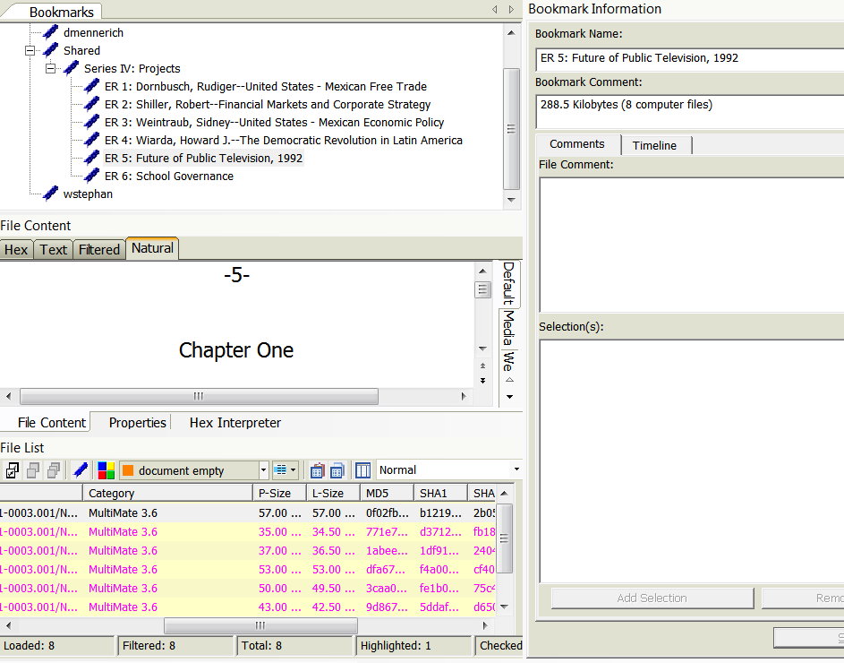

# FTK Processing Instructions
{: .no_toc }
Instructions
{: .no_toc .text-delta }
1. TOC
{:toc}

* Reserve your FTK session at least 24 hours in advance using the
[msserec@gmail.com](https://calendar.google.com/calendar?cid=bXNzZXJlY3NAZ21haWwuY29t){:target="_blank"} calendar.

* Click the FTK icon to open FTK and begin your session. 

* Sign in using your username and password.
    * Your username is the first initial of your first name and
full last name (e.g. smalsbury). 

* Select your collection from the bar on the left hand side of the screen. 

* Open CMS and navigate
to the collection's media log.  

**Information in the media log will assist with processing. You will need to update fields in both locations at various points during processing.**

## Arranging and Describing Archives with FTK

The goal of the arrangement and description phase is to approximate the
process in which an archivist works with a physical collection. By using
FTK the archivist will be able to appraise records as they are contained
on their original media, create a set of intellectual components
(arrangement), summarize the logical extents (size) and date ranges of
the components, and enter them into CMS and ArchivesSpace.

### The Explore Tab

* After opening up the collection in FTK (or "case" in FTK terms) the
application will default to the Explore tab. The Explore tab contains
three main windows, the Evidence tree, the File List, and the File
Content window.

* Click the QuickPix button (the arrow box) to the left of any
node to display all files located at or below the highlighted points in the File List. A Yellow folder icon means there is a node
selected below it. A Green arrow and folder means that node is selected. Unselect the node to remove all files
from the current node and any nodes beneath from the File List.


* You can also select multiple nodes simultaneously.


* Click the arrow for
the top of the hierarchy (always titled Evidence) then click again to remove the selection to reset QuickPix. This will remove all files from
the File List.

* Highlight a file in the File List and FTK will attempt to
render the file in the File Content window Natural pane using an
internal file viewer.


* There are three other panes in the
File Content window, Filtered, Text, and Hex panes for lower-level
interpretations of the file if FTK cannot render the file in Natural. 
    * Hex will display a hexadecimal rendering of the file.
    * Text will render the file as ASCII text with non-printable characters
as ".". Use the encoding drop-down to select an alternate
encoding. 
    * Filtered is similar to Text with the exception that
non-printable characters are ignored, like Text, Filtered defaults to
ASCII encoding, but can be changed via the encoding dropdown.

### PII (Personally Identifiable Information)

* Please check to see if
    any files have the label "Potentially Sensitive" and review to see if they indeed contain
    sensitive material. When digital archives staff uploaded the collection's files into
    FTK, they ran a search for Pii. If there were any hits, these
    files were labeled Potentially Sensitive.

### Filtering

* Use FTK's filtering functionality to reduce the number of files and file system artifacts in the
File List window.

* Select a preset filter from the drop
down on the top of the screen or a click the Filter Manager button next to the filter dropdown to select complex filters. 

#### Simple Filtering 

##### Initial File List window

###### Adding the Actual Files filter


###### Result

* The File List is now yellow in color this
indicates that there is an active filter.


* Experiment with applying different preset filters to get a
feeling for how they affect the File List. 

**Note: Actual Files
filter hides compressed folders like .zip and .stuffit.**

#### Complex filters

##### Initial File List Window


* Click the Filter Manager button on top of the screen.


* Use the arrow keys to create a complex filter that can both include
and exclude files.

Example: Including Actual Files and excluding Folders. 


##### Result


* The active filter can be toggled on and
off using the  button located in the upper left hand
corner of the screen.

####  Creating new filters

* Click the 
 button on the Filter Manager window to create a new filter.

Example: Below is a filter
to display files created in November of 2013. It could be used in the
Filter Manager to either include or exclude files created within that
date range.


* Consult the FTK
Users Guide PDF for an in depth review of filter fields.  

### Visualizing

* Click
 in the upper right hand side of the File
List window for a visualization of files in the File List.


* This window can be used for summarizing the types of files, extensions, 
and dates for a set of files.

### The Overview Tab


In the Overview tab files are organized based on their characteristics
rather than how they were organized when imaged. Below is the Overview
tab with the File Category node opened on the left and the File Status
node opened on the right. Highlight any node to actively display
the files in the File List window, which can then be viewed,
filtered, and visualized in the same manner as the Explore tab.

|   |  |
 
### Labeling

Labeling is a way of applying user-defined tags to files. It can be used
to group together files from anywhere in a collection that can later be
viewed on a single File List. 

* Highlight one or more files from the File List and click the
 button to use labels.


* Click the Manage Local button to create a new label in the current case. Name the label and select a color.

* Select the box for a label from the list in the Labels window and click OK to apply the label to a highlighted file.  


* View the files by label in the Overview tab or sort by label in the Explore tab.  

* Use labels to create new filters in the Filter
Manager.[](dapi/media/image21.png)

 

### Searching


FTK contains two tabs that are used for searching the collection, the
Live Search tab, and the Index Search tab.

#### Index Search

The index search is used to search the full-text index that FTK creates
when disk images are ingested into FTK.

* Lookup terms in the index, highlight the desired term, and click Add.


* Combine terms into a Boolean query and click Search Now.


* Hits will display in the results window.


* Highlight hits to populate the File List. Then you
can filter, bookmark, and label.


#### Live Search

The live search is a more advanced search used for searching across the
files in a collection. While more powerful, this search is processor heavy
and time consuming.

* The Live search has three modes: text, pattern, and hex.

##### Text searching


##### Pattern searching
* Select the Pattern tab. Click the white arrow to the right of the search bar to use preset regular expressions (phone
numbers, social security numbers, credit card numbers, etc.).


* The live search will return results and populate a File List as the index search does.

### Bookmarking

Bookmarks are used to group together files into an intellectual
component to be entered into Aspace. It is in a bookmark that the unit
identifier, unit title, physical extent, and date coverage will all be
recorded.

* Highlight the files to be included in a bookmark from the File List then
right-click and select Create a New Bookmark.  
Or   
* Click the
 button. This
will bring up the Create a New Bookmark pop up.


* Enter a title for the bookmark (it can be a temporary title) and select a
parent node from the Select Bookmark window. 

* Click on the Bookmark tab to view the bookmarks for a collection.



* To finalize a bookmark you will need to enter the unit id, unit title,
and date range of the files in the Bookmark name field. 


* Enter the physical description in the Bookmark Comment field.
This can be determined from the metadata located in the bottom of the
File List.


* Use the following format:
    * LogicalSize Bytes\|KiloBytes\|Megabytes\|Gigabytes (NumberOfFiles
computer files)  

```288.5 Kilobytes (8 computer files)```  

**NOTE: Check whether or not filters are active, as this will
modify these counts.**

### Entering your collection in ArchivesSpace

For instructions on how to enter your electronic records in
ArchivesSpace, please see the [ASpace Users
Guide](https://docs.google.com/document/d/1sAAiJjDArvicy6y5vr61zZ-F_bQPmkoUkQrXnbep6gw/edit?usp=sharing){:target="_blank"}.

#### Archival Objects (Container List)

In ArchivesSpace, an archival object represents anything below the
collection level. Archival objects represent series, subseries, files,
and items. In EAD parlance, an archival object represents a component.
Container lists are created by creating archival objects within a
Resource.

#### Managing Archival Objects


* Archival Objects can only be created within the context of a Resource.
To create an Archival Object, use the Add Sibling or Add Child
buttons (buttons 1). Add Sibling will create a new object at the same
hierarchical level as your current record; Add Child will create one
directly below it.

* Archival objects can be moved within and between resources via this
window. Use Cut and Paste (buttons 2) to cut and paste an archival
object within a resource's component hierarchy. Archival objects can
also be dragged-and-dropped within the hierarchy window (field 6), which
will reorder them within the collection. Similarly, the Move option
(button 3) can be used to more precisely move an archival object around
a collection.

* When clicking-and-dragging archival objects around a collection, a small
arrow will appear on the left of the list. This arrow will indicate
where the archival object will be dropped.


**NOTE THAT ARCHIVAL OBJECTS CANNOT EASILY BE MOVED BACK.** Be extremely
careful when moving archival objects around in a resource!

* The Transfer option (button 4) will move an archival object from one
resource to another.

* The Rapid Data Entry window can be opened by clicking on Rapid Data
Entry (button 5). Please see the section on Rapid Data Entry for more
information.

#### Archival Object Basic Information


* Provide the component's title in Title (field 4). Refer to DACS 2.3
for more information on the formulation of titles. Do not provide the
date in the title; instead provide it in the Date form.

**Note that titles are not required for components.** If a component has
no title, but a date (e.g. "1900-1910" in the "Correspondence" series),
provide the date but do not provide a title.

* The MSS Identifier (field 5) will be automatically generated; do not
provide a value for this field.

* Provide the level of description of the component in the Level of
Description menu (field 6). Select a value as follows:
    * For series-level components, select "Series".
    
    * For subseries-level components, select "Subseries". Choose this only
    for subseries directly under a Series component.

    *   For item-level components, select "Item".

    *   For all other components, select "File".

**Use sound archival judgment when determining the Level of Description
for Archival Objects.**

* Archival objects can be suppressed by selecting the Suppress button
(button 2). Suppressed records will not export in the collection's EAD
export, and will be treated as nonexistent by systems outside of
ArchivesSpace. Contact management in the Archives Unit before
suppressing records.

#### Archival Object Description

* For details on the use of the Identifiers, Agent Links, Subjects, and
Notes sub-forms of the archival object record, please see their
corresponding documentation regarding resource records. Use these
sub-forms in accordance with NYPL processing guidelines and descriptive
best practice.

##### Dates


* Use the Dates sub-form to describe the dates spanned by the archival
object. Refer to DACS 2.4 for instructions on formulating appropriate
dates.

* ArchivesSpace allows for multiple date sub-forms; each sub-form should
describe one date or date range. Do not use broken dates at the
collection level (e.g. "1600, 1900-1910") without approval from Archives
Unit management.

* When creating dates, additional sub-forms can be generated via the Add
Date button (button 3).

* Provide the date in the Expression*field (field 2). Follow the rules
laid out in DACS 2.4 for creating dates.

* Select the type of date in the Type menu (field 2). Select "bulk" for
bulk dates and "inclusive" for all other dates.

##### Extents

* Extents should only be provided for archival objects in the following
scenarios:

    * The archival object represents AMI and should be described as
    carriers and timecode

    * The archival object represents electronic records and should be
    described as computer files and bytes

    * The archival object represents a series and should be described as
    containers and linear feet.

* When describing electronic records, provide the size of the records in
the appropriate magnitude of bytes (kilo/mega/giga) as the Number, and
the unit of measurement as Type. Provide the number of computer files
in the *Container Summary* (e.g. "5 computer files").

* When describing audiovisual material at the archival object level,
include a timecode extent if possible. Timecode extents should have a
Type of "timecode" and a Value formatted as HH:MM:SS (e.g.
"00:27:05"). If the timecode represents the entire extent of the
audiovisual material, set the Portion as "Whole"; otherwise, set it as
"Part".

#### Instance Links


* The Instance form is used to link collection and component records to
container records and digital objects. Container records represent
boxes, digital files, and oversized folders.

* Instance sub-forms can be added by clicking the Add Container Instance
or Add Digital Object buttons instances(buttons 1), or their
corresponding buttons at the bottom (buttons 5). Add an Instance
sub-form for each container associated with an archival object (e.g. an
archival object describing 5 boxes should have 5 Instances).


* Provide the link to the appropriate container in the Top Container
field (field 2). Containers can be searched by typing into the *op
Container field (see above); this will only search containers already
associated with the collection. If the container does not already exist
(or is not already associated with the collection), further options can
be found by clicking the triangle to the right of the field. The
Create option will bring up a window to create a new container (see
"Container Instances" below); the Browse option will bring up an
advanced search window for finding containers.

* If more detailed description of the archival object's container is
needed (for example, if the component represents a range of folders
within a box), provide this information in the Child Type and Child
Indicator fields. Select the type of child container from the Child
Type menu (field 3), and provide its number (or range of numbers) in
Child Indicator (field 4). For example, if an archival object
describes folders 2-5 in a box, the Child Type would be "folder" and
the Child Indicator would be "2-5".

#### Electronic Records

* Electronic records can be attached to components by adding an
Identifier, such as er.1.

### Deaccessions

* Select the Bookmarked filter and then select each
media object in the evidence items window one by one. If there are no
files present that media object can be deaccessioned.

Or

* Select the Bookmarked filter and sort the File List by path. Note MediaIDs that don't appear in the File List.

* The only exception to using this method are media objects that contain
executables or other files that would be better served as a disk image.

## Appendix: De-duplicating Collections

### Running a de-duplication job

* Select Additional Analysis from
the Evidence menu. 

* Select Flag Duplicate Files from the File Hashes group and click OK.


* This will start a comparison of the checksums of all files in the
collection.


* When complete close the Data Processing window.

#### Adding a "duplicate file" column set to a FTK case

* Click the column
settings button from the File List window. Click
the import button and navigate to
```Z:\\FTK\\ColumnDefs\\Duplicates.xml```  click OK and close the column
settings window.

* Select Duplicates from the column dropdown.


* This will add an additional column to the file list titled Duplicate
File that will either be blank or contain the number 1, 2, or 3.


* If the Duplicate File field is blank the file has not been analyzed
for duplication yet, re run the analysis on the previous page.

* The numeral 1 in the Duplicate File field means that the file is
duplicated but it is the first instance of that file in the case. The
numeral 2 means it is a duplicate file and a secondary copy. In the example
above you can see a set of duplicates dm.exe and cm.exe denoted by
their 1 and 2 codes respectively (note that the MD5 and SHA1 are
identical for each file). The numeral 3 means the file is unique and
does not have a duplicate in the collection.

#### Adding a duplicate filter

* Click the import filter button from the Filter Manager
 and navigate to
```Z:\\FTK\\FilterDefs\\DuplicateSecondary.xml``` then click open and OK
to import it into the case.

* The Filter can now be used to either include or exclude secondary
duplicates from a file list.

Example: File list **excluding** secondary duplicates.


Example: File list **including** only secondary data sets.

