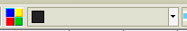
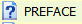
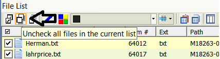
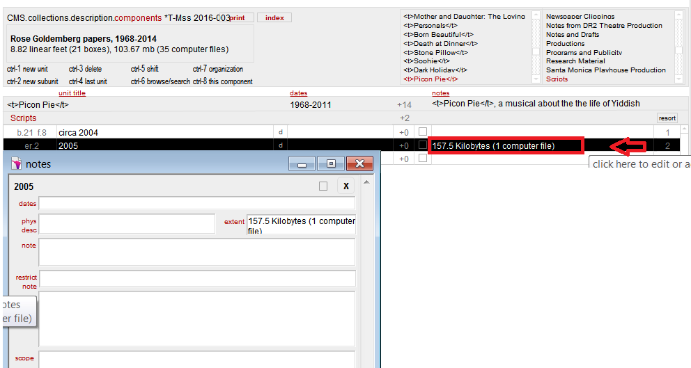

# FTK Quick Start
{: .no_toc }
&nbsp;
{: .no_toc .text*delta }
## Electronic Records Processing Quick Start

### Prepare to Process

* [Reserve your FTK session](../using/using-lab-equipment#reserving-a-workstation-session) at least 24 hours in advance.

* Click the FTK icon to open FTK and begin your session. 

FRED 1 only
{: .label .label-red }

* Sign in using your username and password when using FRED 1.
    * Your username is the first initial of your first name and
full last name (e.g. losborne). 

* Select your collection from the bar on the left hand side of the screen. 

* Open CMS and navigate
to the collection's media log.  

**Information in the media log will assist with processing. You will need to update fields in both locations at various points during processing.**

## Appraisal

* Spend some time evaluating the electronic records before you begin bookmarking. You'll be using the same strategies you use for paper records for the most part but FTK has appraisal tools you should use as well.

### Filters

* Use filters. The Actual Files filter hides some system files, resource forks, and unallocated space.  
* Toggle filters off and on by clicking the filter button to the left of the filter dropdown.  

### Labels  
-   Use labels to identify duplicates, items of interest, possible
    organization, or items you have questions about as you would post-it notes.  
* Right-click on a file or set of selected files and choose 'Labels...' to create or manage labels.  

Or  
* Click the label icon:
    . 
    
* Select 'Manage Local' and click 'New' to create customized labels.  

* View labels as a field in the File List from the Explore tab.  

* Please check to see if
    any files have the label "Potentially Sensitive" and review to see if they contain
    sensitive material.  
    * When digital archives staff uploaded the collection's files into
    FTK, they ran a search for Pii. If there were any hits, these
    files were labeled "Potentially Sensitive".

### File List Fields
-   Expand fields or hide fields that are not useful to you in the File List, which makes up the bottom half of the screen.

-   Click on any field in the File List to sort that field.

    -   Sort by hash (MD5, SHA1, or SHA256) to identify duplicates.

    -   Sort by Name to identify similar file names.

    -   Sort by Path to see the original arrangement on the disk images
        including which files were in a which folder.

    -   Sort Modified date to see date ranges.

-    Use the Category field instead of the Ext field when identifying formats if FTK does not recognize the correct extension.

### Media Log

* Work back and forth between the media log and FTK.  
* Note the label transcript in the media log and compare it to the contents in FTK.  
* The label transcript can provide additional context for the electronic records.  


  | Common Questions |                                                                   
| ----------------------------------------------------------------------------------------------------------------------------------------------------------------------------------------------------------------------------------------------------------------------------------------------------------------------- |
|   |               Files with question mark icons are either formats that are unrecognized or are system files. Use the Ext, Category, L-Size (logical size) and your File Content viewers to determine if this is an actual file to retain. |
|   |   Folders are not filtered out using the Actual File filter but do not include them in your bookmark. Folders are represented in the file directory path and this information is exported alongside your final ER components. |

## Bookmarking

**After you have finished your appraisal - and submitted a processing
proposal - you are ready to begin bookmarking.** 

-   Highlight the files, right-click, select 'Create Bookmark...' or
    'Add to Bookmark', and make sure you are including 'All
    Highlighted' files to bookmark a group of files.

-   Bookmarked files will display pink text in the File List.

**Make sure that you click the
    uncheck all files in the current list icon if you are using checks to select files. Checked files are not cleared automatically and you
    will inadvertently add these files to your next bookmark if you do
    not uncheck.** 



-   Create empty bookmarks to mimic the hierarchical structure of the finding aid.  
    * Right-click a top level bookmark in the Bookmarks tab and select 'Create empty bookmark'.  
    * Drag and drop bookmarks to place them in the hierarchy.  

-   Wait until
    you are finished processing to number your ER components.

**Follow these instructions if you want Digital Archives staff to create a JSON export of bookmarks for ASpace import.**

* Create Bookmarks with Series titles. These bookmarks have no files.
* Create ER bookmarks with files under Series bookmarks.
* Enter the unit id, unit title, and date range of the files in the Bookmark Name field.  
* Bookmark Name: ER[space]number: Title, dates.  
  ```ER 5: Future of Public Television, 1992```

## Wrap Up

* Please let Digital Archives staff known when you are done processing a
collection.

Deprecated
{: .label .label-red }
<!-- CMS components or Aspace only? -->
-   Select 'digital file' from the drop
    down in 'container info' and enter your bookmark number to add components to CMS.

-   Include
    size and number of files in parentheses in the extent field.  
    ```294.2 Kilobytes
    (113 computer files)```  
    Click the notes field from the components
    screen to enter the Notes dialog box.



-   Determine which media objects are to be deaccessioned.

Deprecated
{: .label .label-red }  
  
-   Complete the following fields in the collection
    tracking bar at the top of the media log in CMS:

    -   Click on the calendar icon next to the 'Ecomponents created'
        field to add the date you finished creating your bookmarks.


* Add the final Finding aid extent. If you have to convert your
        extent to Kilobytes, use 
        ([Byte Converter](http://www.whatsabyte.com/P1/byteconverter.htm){:target="_blank"}).

*  Please see the [ASpace Users
Guide](https://docs.google.com/document/d/1sAAiJjDArvicy6y5vr61zZ-F_bQPmkoUkQrXnbep6gw/edit?usp=sharing{:target="_blank"}) for instructions on how to enter your electronic records in
ArchivesSpace.