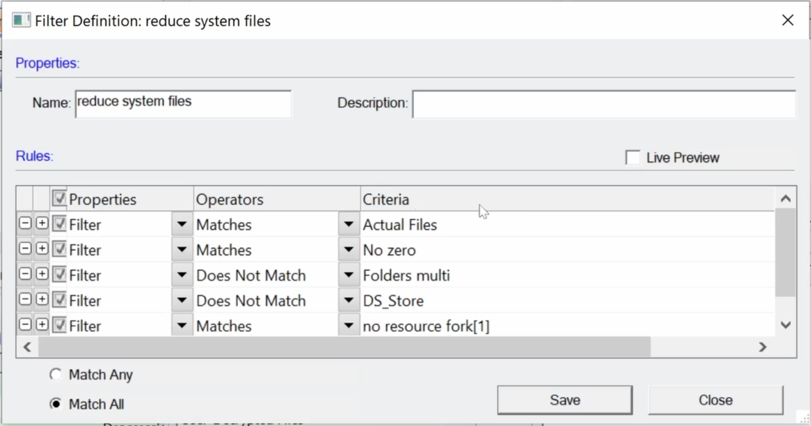

# Filters and zips
This video shows how the Actual Files filter deals with zips and files within zips. It demonstrates filters that will show files in zips that are available to import if you don’t see them in your collection. It displays what the File List looks like when a filter is active and how to toggle filters on and off.

  <iframe
      src="https://www.youtube.com/embed/rAtmTcIiRuM"
      width="700"
      height="480"
      frameborder="0"
      allowfullscreen="true">
  </iframe>

FTK can display files within Zip containers. But using Actual Files filter hides files in Zips.

Click Filter Manger.

Check default and imported filters for Actual Files. Select a filter.

Click Define.

Note Operators: Matches, Criteria: Actual Files. This filter only displays actual files.

File List displays yellow when a filter is on. Note Zip is displayed not .doc files within.

Click funnel in upper left corner to toggle filter off.

With the filter off File List displays .doc files within Zip container.  
Click Filter Manger.

Select a filter with “include zip extracted”. See import filter for more filters.

Note Actual Files does not appear in filter Rules Criteria.

Files within Zip container (.doc files) appear while filter is on. Yellow File List shows filter is on.
