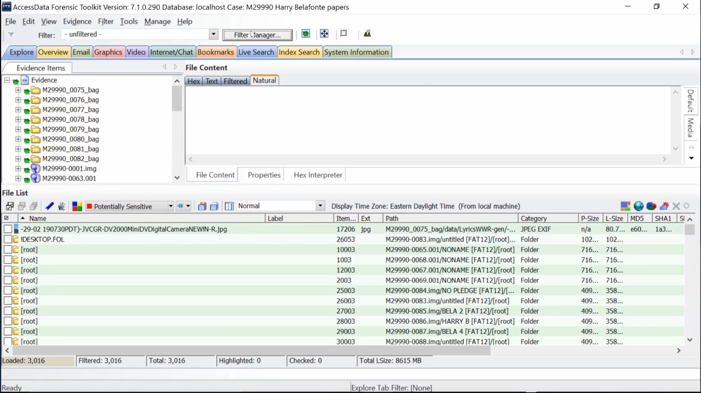
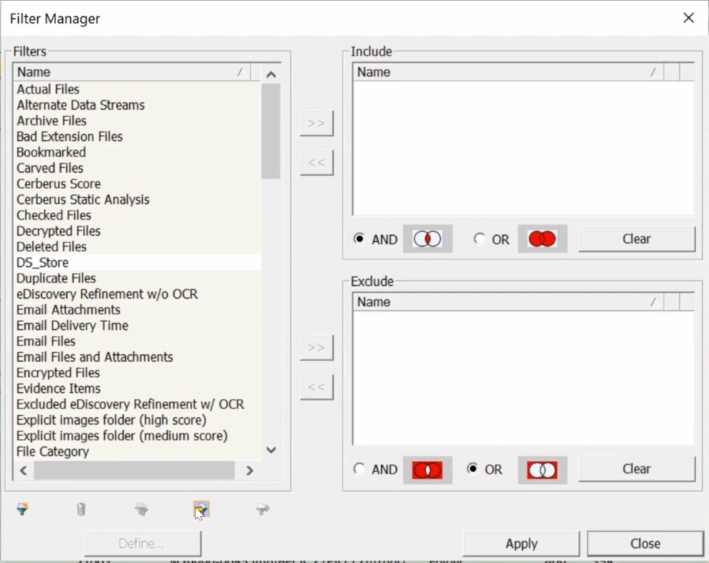
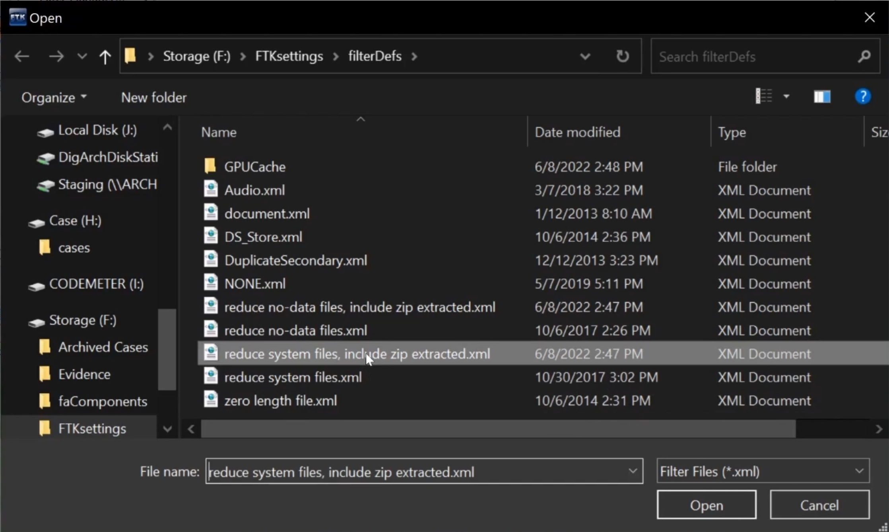
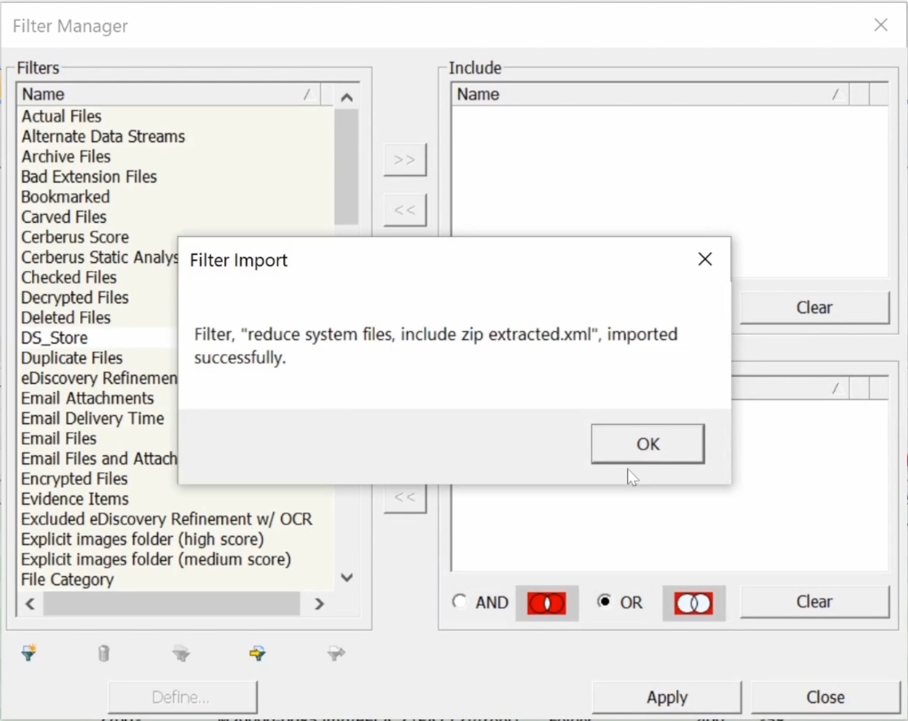
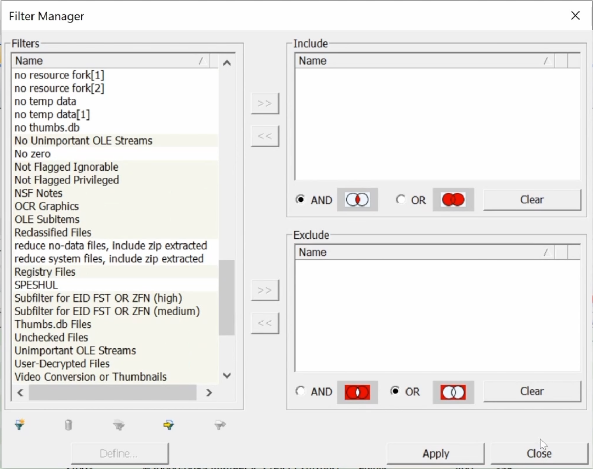

# Importing a filter
This video demonstrates how to import a filter from the FTKsettings folder on the FREDs.

<!-- https://user-images.githubusercontent.com/34036628/205160392-6c51f433-b038-4303-9576-6b464ce22494.mov -->

  <iframe
      src="https://www.youtube.com/embed/feKuPof1ljs"
      width="700"
      height="480"
      frameborder="0"
      allowfullscreen="true">
  </iframe>

Click Filter Manager

Select funnel icon second from right on bottom left of Filter Manager

A File Explorer window should pop up. Navigate to Storage/FTKsettings/filterDefs.

Select a filter to import. Click Open.

A dialog box should say “imported successfully”. Click OK.

The imported filter now appears in the Filters list.