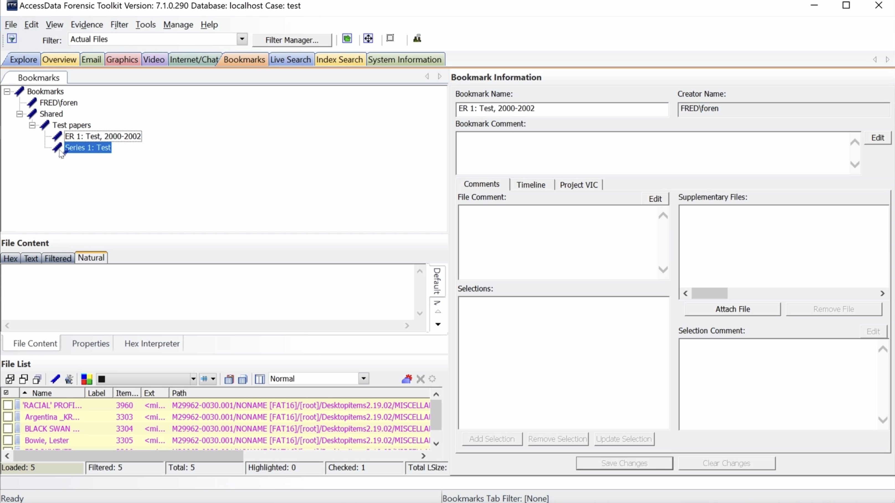
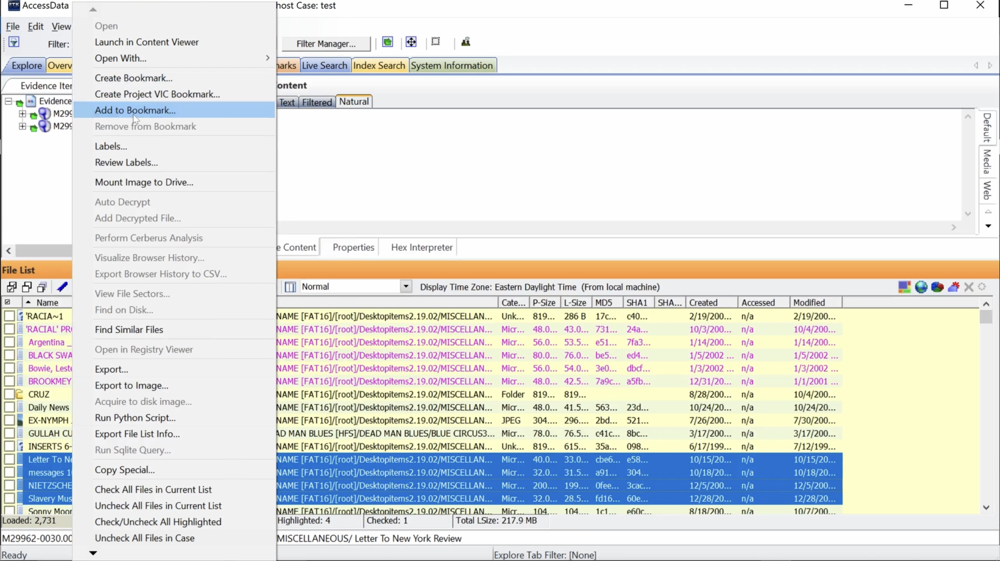

# Moving bookmarks and adding files
This video show you how to move bookmarks in a hierarchy. It also demonstrates how to create bookmarks and how to add files to an existing bookmark.

  <iframe
      src="https://www.youtube.com/embed/ajCRLVpJrEA"
      width="700"
      height="480"
      frameborder="0"
      allowfullscreen="true">
  </iframe>

## Moving bookmarks

From Bookmarks tab, Select Bookmark, hold, and drag to move.

Note bookmark now appears below based on the direction it was moved.

## Adding files to existing bookmark

Click Explore tab. To add files to a bookmark, select a range of files.

Right click. Select add to bookmark.

Select bookmark to add files to under Select Existing Bookmark at bottom of window. Click OK.

Click Bookmarks tab. Note files added to bookmark in File List.