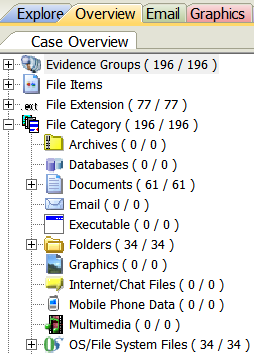
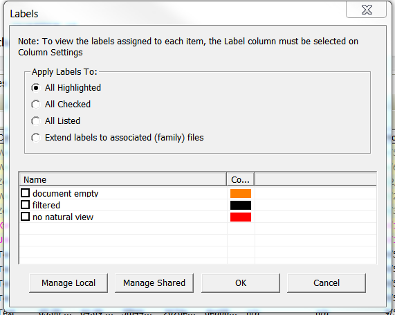
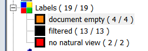
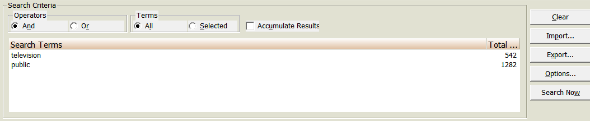
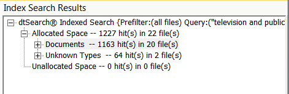
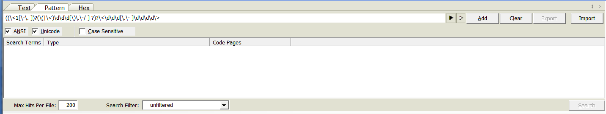

# Navigating Forensic Toolkit
FTK displays tabs under the menu to organize functions of the software. You will use the Explore and Bookmarks tabs most. Overview and Search tabs are also useful on occasion.

## The Explore Tab

* Note the Explore tab is the default view after opening up the collection in FTK.  
* The Explore tab contains three main windows.  
    * Evidence tree  
    * File List  
    * File Content window  

## Evidence Tree

* Click the QuickPix button (the arrow box) to the left of any
node to display all files located at or below the highlighted points in the File List.  
* A Yellow folder icon means there is a node
selected below it.  
* A Green arrow and folder means that node is selected.  
* Unselect the node to remove all files from the current node and any nodes beneath from the File List.  

* You can also select multiple nodes simultaneously.

* Click the arrow for
the top of the hierarchy (Evidence) then click again to remove the selection to reset QuickPix. This will remove all files from
the File List.

## File List  
-   Expand fields or hide fields that are not useful to you in the File List, which makes up the bottom half of the screen.

-   Click on any field in the File List to sort that field.

    -   Sort by hash (MD5, SHA1, or SHA256) to identify duplicates.

    -   Sort by Name to identify similar file names.

    -   Sort by Path to see the original arrangement on the disk images
        including which files were in a which folder.

    -   Sort Modified date to see date ranges.

-    Use the Category field instead of the Ext field when identifying formats if FTK does not recognize the correct extension.

## File Content Window

* Highlight a file in the File List and FTK will attempt to
render the file in the File Content window Natural pane using an
internal file viewer.

* View Hex, Text, and  Filtered tabs for lower-level interpretations of the file if FTK cannot render the file in Natural.  
    * Click the Hex tab to view a hexadecimal rendering of the file.
    * Click the Text tab to view the file as ASCII text with non-printable characters
as ".". 
    * Use the encoding drop-down to select an alternate
encoding. 
    * Click the Filtered tab to view text with non-printable characters ignored.  
    * Use the encoding drop-down to select an alternate
encoding. 

## Icons
Icons representing files indicate the type of file you are viewing.
* Folders  
  
* Slack Space  
  
* Deleted Files  
  
* File systems  
  
* Unknown formats  
  

## Icons to Watch Out for
In the normal course of events you shouldn’t see the following formats when you view files in FTK. Digital Archives staff apply profiles to FTK to keep from displaying Slack Space and Deleted files. If you see them please let us know before you proceed. We either need to review our work or identify the problem with the transfer. Unrecognized files systems and home video DVDs should be removed from FTK before you view files. DVDs are treated as AMI and not arranged as electronic records. Unrecognized file systems are most likely bad disks but might be in a format that requires emulation.

## Stop and discuss with Digital Archives staff if you see…

* Slack Space  
  
* Deleted Files  
  
* Unrecognized file systems  
  
* DVDs
    * VIDEO_TS
* Seeing the above formats means something has gone awry
  
## Unviewable Formats
You should also stop and talk to us before proceeding if you see unviewable files that you think are in scope. There are many files that FTK designates as unknown. For many of these files you are still able to view the complete contents of the file in natural or filtered view. Those files can be arranged as usual. If you encounter files where you cannot see the complete contents in any view but think the files are in scope please discuss these files with digital archives staff. In the case of image files with no view in FTK like Canon RAW we can stage these images so you can view them with software outside of FTK. Another common example is Quark files. You can sometimes see limited text for Quark files in filtered view but you can’t view any images. Since we can only partially review these files we need to be aware of them if they are being arranged in packages for access.

## Stop and discuss with Digital Archives staff if you see…
* Unknown formats with no Natural view and a limited Filtered view that are in scope  
  
* Files that you would like to view outside of FTK  
* Files that you cannot completely review  

## Out of Scope Formats
There are some file types that either can’t be exported from FTK or don’t provide useful information. These file types should not be bookmarked. Sometimes the presence of many temp or system files can be confusing for researchers, making it difficult to find files with content among the many temp files. Unless you have received specific instructions from Digital Archives staff to the contrary, don’t bookmark folders, Slack Space, deleted files, file systems, .DS_Stores, Resource Forks, Alternate Data Streams, temp files, desktop DB or Icons.

## Don't Bookmark
* Folders  
  
* Slack Space  
  
* Deleted Files  
  
* File systems  
  
* .DS_STORE
* Resource Forks  
  
* Alternate Data Streams  
  
* temp files (~ or . in front)
* desktop DB
* Icon

## PII (Personal Identifiable Information)

* Please check to see if
    any files have the label "Potentially Sensitive" and review to see if they contain
    sensitive material.  
    * When digital archives staff uploaded the collection's files into
    FTK, they ran a search for Pii. If there were any hits, these
    files were labeled "Potentially Sensitive".

## The Overview Tab

In the Overview tab files are organized based on their characteristics
rather than how they were organized when imaged. Below is the Overview
tab with the File Category node opened on the left and the File Status
node opened on the right. Highlight any node to actively display
the files in the File List window, which can then be viewed and 
filtered in the same manner as the Explore tab.

|   |  |
 
## Labeling

Labeling is a way of applying user-defined tags to files. It can be used
to group together files from anywhere in a collection that can later be
viewed on a single File List. 

* Highlight one or more files from the File List and click the
 button of 4 squares to use labels.

* Click the Manage Local button to create a new label in the current case.  
* Name the label and select a color.  

* Select the box for a label from the list in the Labels window.  
* Click OK to apply the label to a highlighted file.  

* View the files by label in the Overview tab or sort by label in the Explore tab.  

* Use labels to create new filters in the Filter
Manager.

 

## Searching

FTK contains two tabs that are used for searching the collection, the
Live Search tab, and the Index Search tab.

### Index Search

The index search is used to search the full-text index that FTK creates
when disk images or files are ingested into FTK.

* Look up terms in the index, highlight a term, and click Add.

* Select And/Or Operators and click Search Now.

* Click Apply filter and Select a filter from the dropdown to apply a filter to results. Click OK.  

* Hits will display in the results window.

* Highlight hits to populate the File List.

### Live Search

The live search is a more advanced search used for searching across the
files in a collection. While more powerful, this search is processor heavy
and time consuming.

* The Live search has three modes: text, pattern, and hex.

#### Text Searching

* Enter text and click the Add button.  
* Enter a value (1) in Max Hits per File.  
* Select a filter from the dropdown next to Search Filter if you want to filter results.  
* Click the Search button.  

#### Pattern Searching
* Select the Pattern tab. 
* Click the white arrow to the right of the search bar to use preset regular expressions  
(phone
numbers, social security numbers, credit card numbers, etc.).

* Select a pattern from the menu to the right.  

* Click the Search button.  
* Hits will display in the results window.  
* Highlight hits to populate the File List.  