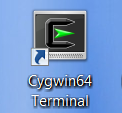
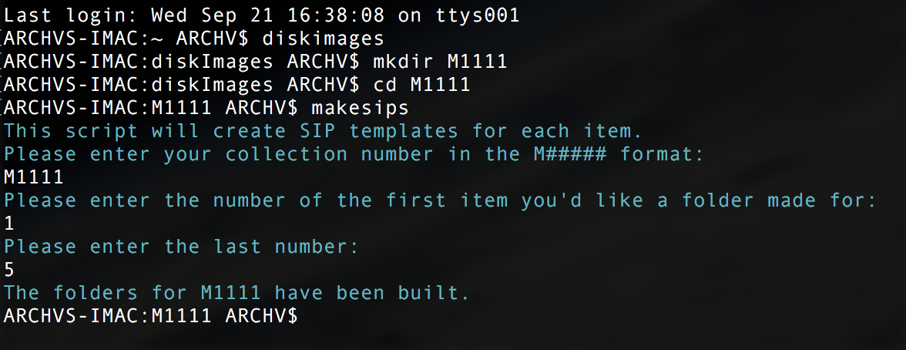

# File Transfers
{: .no_toc }

## Table of contents
{: .no_toc .text-delta }

1. TOC
{:toc}

# Introduction


 Born digital collection material can be acquired through file transfer or forensic imaging. Most material will be transferred using a Bagit script through command line. 

 The file transfer workflows are detailed in this document. The workflows may vary based on media types and file types encountered but the general steps are as follows:  

1.  Verify inventory in the media log

2.  Build SIPs

3.  Transfer files from media object

## Verify inventory in the media log

* Before a media object can be transferred it first must be recorded in the collection’s media log in CMS.

* Open CMS and locate the collection that you will be working with. Navigate to the electronic records view through the collection management screen. Click on the media number that you are going to transfer from the “other objects” list. Contact the Digital Archives Assistant if the media object is not listed in CMS.

## Build SIPs
**These instructions show you how to create SIPs for a number of consecutive disks. Consider using a one-line command to create directories if the disks you are packaging do not have consecutive MediaID numbers or you are only transferring one media object.**  

* Run [makesips script](../software#makesips-script){:target="_blank"} to create a consecutive number of submission information packages for material from digital media.
  
On Windows: 
* Start Cygwin from the desktop. A terminal like screen should appear.

  

On Mac:
* Open Terminal.  

* Connect to ARCHV Mac.  
```$ ssh archv```  

* Change to fileTransfers directory.  
```$ filetransfers```

* Create a directory for your collection if it does not exist.  
```$ mkdir M1111```  

* Change into your collection directory.  
```$ cd M1111```  

* Run the program to build structured SIP directories. The program will ask you for your collection name and the first and last number of items of the SIPs you’d like to build.  
```$ makesips```  



Or

* ``mkdir`` command can be used to create SIPs. This works when SIPs aren't consecutively numbered. 0001 to 0009 require a different line from 0010 on.  
```mkdir -p CollID/Media-000{1..9}/{metadata/submissionDocumentation,objects}```  
```mkdir -p CollID/Media-00{10..99}/{metadata/submissionDocumentation,objects}```  
```mkdir -p CollID/Media-000{1,5,7,9}/{metadata/submissionDocumentation,objects}```  


### SIP structure

* /M2319-0021

     * /metadata

          * /submissionDocumentation

     * /objects

## Transfer files from media object

Files that have been updated by the donor within the past 30
 days should be quarantined for 30 days to ensure that
 all virus definitions are up to date.

* Use a write-blocker to connect the drive to the computer.

* Run [ft.sh ](../software#ftsh){:target="_blank"} to create a transfer package.   

On Windows: 
* Start Cygwin from the desktop. A terminal like screen should appear.

  

On Mac:
* Open Terminal.  
 
* Enter the alias ```FT``` and hit return.

Or

* Enter ```/usr/local/bin/ft.sh``` and hit return if the alias is not set.

* Drag the SIP folder from the media object to the window and hit return as prompted.

* Enter the MediaID for the file transfer and hit return.

* Copy the number of files in payload and the size of payload in kb when displayed in the window.

* Paste the number of files and the size in the File Transfers section of the media log in CMS.

* To ensure all packages for a collection are complete run qctools.

On Windows:

* Start Cygwin from the desktop. A terminal like screen should appear.


On Mac:
* Open Terminal.  

* Connect to ARCHV Mac.  

 ```$ ssh archv```

* Change to fileTransfers directory.

 ```$ fileTransfers```

* Changed into collection directory.

 ```$ cd M1111```

* Run program to check packages.

 ```$ qctools```
